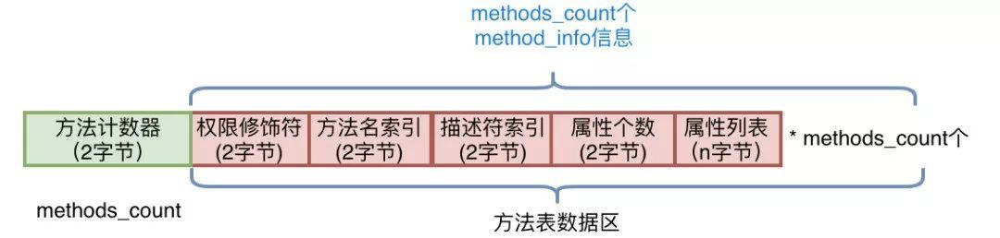

# 什么是字节码？

因为JVM针对各种操作系统和平台都进行了定制，无论在什么平台，都可以通过javac命令将一个.java文件编译成固定格式的字节码（.class文件）供JVM使用。之所以被称为字节码，是因为**.class文件是由十六进制值组成的，JVM以两个十六进制值为一组，就是以字节为单位进行读取**
格式如下

# 字节码的组成结构是什么？

JVM对字节码的规范是有要求的，要求每一个字节码文件都要有十部分固定的顺序组成，如下图：

1. 魔数

所有的.class文件的前4个字节都是魔数，魔数以一个固定值：0xCAFEBABE，放在文件的开头，JVM就可以根据这个文件的开头来判断这个文件是否可能是一个.class文件，如果是以这个开头，才会往后执行下面的操作，这个魔数的固定值是Java之父James Gosling指定的，意为CafeBabe（咖啡宝贝）

2. 版本号

版本号是魔术之后的4个字节，前两个字节表示次版本号（Minor Version），后两个字节表示主版本号（Major Version），上面的0000 0032，次版本号0000转为十进制是0，主版本号0032 转为十进制50，对应下图的版本映射关系，可以看到对应的java版本号是1.6

3. 常量池

紧接着主版本号之后的字节为常量池入口，常量池中有两类常量：字面量和符号引用，字面量是代码中申明为Final的常量值，符号引用是如类和接口的全局限定名、字段的名称和描述符、方法的名称和描述符。常量池整体分为两个部分：常量池计数器以及常量池数据区

4. 访问标志

常量池结束后的两个字节，描述的是类还是接口，以及是否被Public、Abstract、Final等修饰符修饰，JVM规范规定了9种访问标示（Access_Flag）JVM是通过按位或操作来描述所有的访问标示的，比如类的修饰符是Public Final，则对应的访问修饰符的值为ACC_PUBLIC | ACC_FINAL，即0x0001 | 0x0010=0x0011

5. 当前类索引

访问标志后的两个字节，描述的是当前类的全限定名，这两个字节保存的值是常量池中的索引值，根据索引值就能在常量池中找到这个类的全限定名

6. 父类索引

当前类名后的两个字节，描述的父类的全限定名，也是保存的常量池中的索引值

7. 接口索引

父类名称后的两个字节，是接口计数器，描述了该类或者父类实现的接口数量，紧接着的n个字节是所有接口名称的字符串常量的索引值

8. 字段表

用于描述类和接口中声明的变量，包含类级别的变量和实例变量，但是不包含方法内部声明的局部变量，字段表也分为两个部分，第一部分是两个字节，描述字段个数，第二部分是每个字段的详细信息fields_info

9. 方法表

字段表结束后为方法表，方法表也分为两个部分，第一个部分是两个字节表述方法的个数，第二部分是每个方法的详细信息
方法的访问信息比较复杂，包括方法的访问标志、方法名、方法的描述符和方法的属性：

10. 附加属性

字节码的最后一部分，该项存放了在该文件中类或接口所定义属性的基本信息。

7. 

# JVM常用性能调优工具有哪些？

1. MAT
   1. 提示可能的内存泄露的点
   1. 

2. jvisualvm
3. jconsole
4. Arthas
5. show-busy-java-threads
   1. [https://github.com/oldratlee/useful-scripts/blob/master/docs/java.md#-show-busy-java-threads](https://github.com/oldratlee/useful-scripts/blob/master/docs/java.md#-show-busy-java-threads)
      #### 

# **什么情况下，会抛出OOM呢？**

- JVM98%的时间都花费在内存回收
- 每次回收的内存小于2%

满足这两个条件将触发OutOfMemoryException，这将会留给系统一个微小的间隙以做一些Down之前的操作，比如手动打印Heap Dump。并不是内存被耗空的时候才抛出
****

# **系统OOM之前都有哪些现象？**

- 每次垃圾回收的时间越来越长，由之前的10ms延长到50ms左右，FullGC的时间也有之前的0.5s延长到4、5s
- FullGC的次数越来越多，最频繁时隔不到1分钟就进行一次FullGC
- 老年代的内存越来越大并且每次FullGC后，老年代只有少量的内存被释放掉

# 如何进行堆Dump文件分析？

可以通过指定启动参数 -XX:+HeapDumpOnOutOfMemoryError -XX:HeapDumpPath=/usr/app/data/dump/heapdump.hpro 在发生OOM的时候自动导出Dump文件

1. 

# JVM8为什么要增加元空间？

原因：
1、字符串存在永久代中，容易出现性能问题和内存溢出。
2、类及方法的信息等比较难确定其大小，因此对于永久代的大小指定比较困难，太小容易出现永久代溢出，太大则容易导致老年代溢出。
3、永久代会为 GC 带来不必要的复杂度，并且回收效率偏低。

# JVM8中元空间有哪些特点？

1，每个加载器有专门的存储空间。
2，不会单独回收某个类。
3，元空间里的对象的位置是固定的。
4，如果发现某个加载器不再存货了，会把相关的空间整个回收

# 线上元空间内存泄露优化方案有哪些？

1. 需要注意的一点是 Java8以及Java8+的JVM已经将永久代废弃了，取而代之的是元空间，且元空间是不是在JVM堆中的，而属于堆外内存，受最大物理内存限制。最佳实践就是我们在启动参数中最好设置上 -XX:MetaspaceSize=1024m -XX:MaxMetaspaceSize=1024m。具体的值根据情况设置。为避免动态申请，可以直接都设置为最大值
1. 元空间主要存放的是类元数据，而且metaspace判断类元数据是否可以回收，是根据加载这些类元数据的Classloader是否可以回收来判断的，只要Classloader不能回收，通过其加载的类元数据就不会被回收。所以线上有时候会出现一种问题，由于框架中，往往大量采用类似ASM、javassist等工具进行字节码增强，生成代理类。如果项目中由主线程频繁生成动态代理类，那么就会导致元空间迅速占满，无法回收
1. 具体案例可以参见： [https://zhuanlan.zhihu.com/p/200802910](https://zhuanlan.zhihu.com/p/200802910)

# java类加载器有哪些？

**Bootstrap类加载器**

启动类加载器主要加载的是JVM自身需要的类，这个类加载使用C++语言实现的，没有父类，是虚拟机自身的一部分，它负责将 **<JAVA_HOME>/lib路径下的核心类库**或**-Xbootclasspath参数指定的路径下的jar包**加载到内存中，注意必由于虚拟机是按照文件名识别加载jar包的，如rt.jar，如果文件名不被虚拟机识别，即使把jar包丢到lib目录下也是没有作用的(出于安全考虑，Bootstrap启动类加载器只加载包名为java、javax、sun等开头

**Extention 类加载器**

扩展类加载器是指Sun公司实现的sun.misc.Launcher$ExtClassLoader类，**由Java语言实现的**，父类加载器为null，是Launcher的静态内部类，它负责加载**<JAVA_HOME>/lib/ext目录下**或者由系统变量**-Djava.ext.dir指定位路径中的类库**，开发者可以直接使用标准扩展类加载器

**Application类加载器**

称应用程序加载器是指 Sun公司实现的sun.misc.Launcher$AppClassLoader。父类加载器为ExtClassLoader，它负责加载**系统类路径java -classpath**或**-D java.class.path 指定路径下的类库**，也就是我们经常用到的**classpath路径**，开发者可以直接使用系统类加载器，一般情况下该类加载是程序中默认的类加载器，通过ClassLoader#getSystemClassLoader()方法可以获取到该类加载器
****

**Custom自定义类加载器**

应用程序可以自定义类加载器，父类加载器为AppClassLoader

# 双亲委派机制是什么？

## 

双亲委派机制
双亲委派模式是在Java 1.2后引入的，其工作原理的是，如果一个类加载器收到了类加载请求，它并不会自己先去加载，而是把这个**请求委托给父类的加载器去执行**，如果父类加载器还存在其父类加载器，则**进一步向上委托，依次递归**，**请求最终将到达顶层的启动类加载器**，如果父类加载器可以完成类加载任务，就成功返回，倘若父类加载器无法完成此加载任务，子加载器才会尝试自己去加载，这就是双亲委派模式。

双亲委派的好处

   - 每一个类都只会被加载一次，避免了重复加载
   - 每一个类都会被尽可能的加载（从引导类加载器往下，每个加载器都可能会根据优先次序尝试加载它）
   - 有效避免了某些恶意类的加载（比如自定义了Java.lang.Object类，一般而言在双亲委派模型下会加载系统的Object类而不是自定义的Object类）

另外，可以多讲一下，如何破坏双亲委派模型

1. 双亲委派模型的第一次“被破坏”是重写自定义加载器的loadClass(),jdk不推荐。一般都只是重写findClass()，这样可以保持双亲委派机制.而loadClass方法加载规则由自己定义，就可以随心所欲的加载类
1. 双亲委派模型的第二次“被破坏”是ServiceLoader和Thread.setContextClassLoader()。即线程上下文类加载器（contextClassLoader）。双亲委派模型很好地解决了各个类加载器的基础类统一问题(越基础的类由越上层的加载器进行加载)，基础类之所以被称为“基础”，是因为它们总是作为被调用代码调用的API。但是，如果基础类又要调用用户的代码，那该怎么办呢？线程上下文类加载器就出现了。
   1. SPI。这个类加载器可以通过java.lang.Thread类的setContextClassLoader()方法进行设置，如果创建线程时还未设置，它将会从父线程中继承一个；如果在应用程序的全局范围内都没有设置过，那么这个类加载器默认就是应用程序类加载器。了有线程上下文类加载器，JNDI服务使用这个线程上下文类加载器去加载所需要的SPI代码，也就是父类加载器请求子类加载器去完成类加载动作，这种行为实际上就是打通了双亲委派模型的层次结构来逆向使用类加载器，已经违背了双亲委派模型，但这也是无可奈何的事情。Java中所有涉及SPI的加载动作基本上都采用这种方式，例如JNDI,JDBC,JCE,JAXB和JBI等。
   1. 线程上下文类加载器默认情况下就是AppClassLoader，那为什么不直接通过getSystemClassLoader()获取类加载器来加载classpath路径下的类的呢？其实是可行的，但这种直接使用getSystemClassLoader()方法获取AppClassLoader加载类有一个缺点，那就是代码部署到不同服务时会出现问题，如把代码部署到Java Web应用服务或者EJB之类的服务将会出问题，因为这些服务使用的线程上下文类加载器并非AppClassLoader，而是Java Web应用服自家的类加载器，类加载器不同。，所以我们应用该少用getSystemClassLoader()。总之不同的服务使用的可能默认ClassLoader是不同的，但使用线程上下文类加载器总能获取到与当前程序执行相同的ClassLoader，从而避免不必要的问题
1. 双亲委派模型的第三次“被破坏”是由于用户对程序动态性的追求导致的，这里所说的“动态性”指的是当前一些非常“热门”的名词：代码热替换、模块热部署等，简答的说就是机器不用重启，只要部署上就能用。

# 如何回收内存对象，有哪些回收算法？ 

**1.标记-清除（Mark-Sweep）算法**  

分为标记和清除两个阶段：首先标记出所有需要回收的对象，在标记完成后统一回收所有被标记的对象。

它的主要不足有两个：

- 效率问题，标记和清除两个过程的效率都不高。
- 空间问题，标记清除之后会产生大量不连续的内存碎片，空间碎片太多可能会导致以后在程序运行过程中需要分配较大对象时，无法找到足够的连续内存而不得不提前触发另一次垃圾收集动作。

2. **复制算法**

为了解决效率问题，一种称为复制（Copying）的收集算法出现了，它将可用内存按容量划分为大小相等的两块，每次只使用其中的一块。当这一块的内存用完了，就将还存活着的对象复制到另外一块上面，然后再把已使用过的内存空间一次清理掉。这样使得每次都是对整个半区进行内存回收，内存分配时也就不用考虑内存碎片等复杂情况，只要移动堆顶指针，按顺序分配内存即可，实现简单，运行高效。

**复制算法的代价**是将内存缩小为了原来的一半，减少了实际可用的内存。现在的商业虚拟机都采用这种收集算法来回收新生代，IBM公司的专门研究表明，新生代中的对象98%是“朝生夕死”的，所以并不需要按照1:1的比例来划分内存空间，而是将内存分为一块较大的Eden空间和两块较小的Survivor空间，每次使用Eden和其中一块Survivor。当回收时，将Eden和Survivor中还存活着的对象一次性地复制到另外一块Survivor空间上，最后清理掉Eden和刚才用过的Survivor空间。HotSpot虚拟机默认Eden和Survivor的大小比例是8:1，也就是每次新生代中可用内存空间为整个新生代容量的90%（80%+10%），只有10%的内存会被“浪费”。当然，98%的对象可回收只是一般场景下的数据，我们没有办法保证每次回收都只有不多于10%的对象存活，当Survivor空间不够用时，需要依赖其他内存（这里指老年代）进行分配担保（Handle Promotion）。

3. **标记-整理算法**

复制收集算法在对象存活率较高时就要进行较多的复制操作，效率将会变低。更关键的是，如果不想浪费50%的空间，就需要有额外的空间进行分配担保，以应对被使用的内存中所有对象都100%存活的极端情况，所以在老年代一般不能直接选用这种算法。根据老年代的特点，有人提出了另外一种标记-整理（Mark-Compact）算法，标记过程仍然与标记-清除算法一样，但后续步骤不是直接对可回收对象进行清理，而是让所有存活的对象都向一端移动，然后直接清理掉端边界以外的内存。

4. **分代收集算法**

当前商业虚拟机的垃圾收集都采用分代收集（Generational Collection）算法，这种算法并没有什么新的思想，只是根据对象存活周期的不同将内存划分为几块。一般是把Java堆分为新生代和老年代，这样就可以根据各个年代的特点采用最适当的收集算法。在新生代中，每次垃圾收集时都发现有大批对象死去，只有少量存活，那就选用复制算法，只需要付出少量存活对象的复制成本就可以完成收集。而老年代中因为对象存活率高、没有额外空间对它进行分配担保，就必须使用标记—清理或者标记—整理算法来进行回收。

#  jvm有哪些垃圾回收器，实际中如何选择？ 

图中展示了7种作用于不同分代的收集器，如果两个收集器之间存在连线，则说明它们可以搭配使用。虚拟机所处的区域则表示它是属于新生代还是老年代收集器。
新生代收集器（全部的都是复制算法）：Serial、ParNew、Parallel Scavenge
老年代收集器：CMS（标记-清理）、Serial Old（标记-整理）、Parallel Old（标记整理）
整堆收集器： G1（一个Region中是标记-清除算法，2个Region之间是复制算法）
同时，先解释几个名词：
1，**并行（Parallel）**：多个垃圾收集线程并行工作，此时用户线程处于等待状态
2，**并发（Concurrent）**：用户线程和垃圾收集线程同时执行
3，**吞吐量**：运行用户代码时间／（运行用户代码时间＋垃圾回收时间）
**1.Serial收集器是最基本的、发展历史最悠久的收集器。**
**特点：**单线程、简单高效（与其他收集器的单线程相比），对于限定单个CPU的环境来说，Serial收集器由于没有线程交互的开销，专心做垃圾收集自然可以获得最高的单线程手机效率。收集器进行垃圾回收时，必须暂停其他所有的工作线程，直到它结束（Stop The World）。
**应用场景**：适用于Client模式下的虚拟机。
**Serial / Serial Old收集器运行示意图**

**2.ParNew收集器其实就是Serial收集器的多线程版本。**
除了使用多线程外其余行为均和Serial收集器一模一样（参数控制、收集算法、Stop The World、对象分配规则、回收策略等）。
**特点**：多线程、ParNew收集器默认开启的收集线程数与CPU的数量相同，在CPU非常多的环境中，可以使用-XX:ParallelGCThreads参数来限制垃圾收集的线程数。
　　　和Serial收集器一样存在Stop The World问题
**应用场景**：ParNew收集器是许多运行在Server模式下的虚拟机中首选的新生代收集器，因为它是除了Serial收集器外，唯一一个能与CMS收集器配合工作的。
_ParNew/Serial Old组合收集器运行示意图如下：_

**3.Parallel Scavenge 收集器与吞吐量关系密切，故也称为吞吐量优先收集器。**
**特点**：属于新生代收集器也是采用复制算法的收集器，又是并行的多线程收集器（与ParNew收集器类似）。
该收集器的目标是达到一个可控制的吞吐量。还有一个值得关注的点是：GC自适应调节策略（与ParNew收集器最重要的一个区别）
**GC自适应调节策略**：Parallel Scavenge收集器可设置-XX:+UseAdptiveSizePolicy参数。当开关打开时不需要手动指定新生代的大小（-Xmn）、Eden与Survivor区的比例（-XX:SurvivorRation）、晋升老年代的对象年龄（-XX:PretenureSizeThreshold）等，虚拟机会根据系统的运行状况收集性能监控信息，动态设置这些参数以提供最优的停顿时间和最高的吞吐量，这种调节方式称为GC的自适应调节策略。
Parallel Scavenge收集器使用两个参数控制吞吐量：

- XX:MaxGCPauseMillis 控制最大的垃圾收集停顿时间
- XX:GCRatio 直接设置吞吐量的大小。

**4.Serial Old是Serial收集器的老年代版本。**
**特点**：同样是单线程收集器，采用标记-整理算法。
**应用场景**：主要也是使用在Client模式下的虚拟机中。也可在Server模式下使用。
Server模式下主要的两大用途（在后续中详细讲解···）：

1. 在JDK1.5以及以前的版本中与Parallel Scavenge收集器搭配使用。
1. 作为CMS收集器的后备方案，在并发收集Concurent Mode Failure时使用。

Serial / Serial Old收集器工作过程图（Serial收集器图示相同）：

**5.Parallel Old是Parallel Scavenge收集器的老年代版本。**
**特点**：多线程，采用标记-整理算法。
**应用场景**：注重高吞吐量以及CPU资源敏感的场合，都可以优先考虑Parallel Scavenge+Parallel Old 收集器。
_Parallel Scavenge/Parallel Old收集器工作过程图：_
**6.CMS收集器是一种以获取最短回收停顿时间为目标的收集器。**
**特点**：基于标记-清除算法实现。并发收集、低停顿。
**应用场景**：适用于注重服务的响应速度，希望系统停顿时间最短，给用户带来更好的体验等场景下。如web程序、b/s服务。
**CMS收集器的运行过程分为下列4步：**
**初始标记**：标记GC Roots能直接到的对象。速度很快但是仍存在Stop The World问题。
**并发标记**：进行GC Roots Tracing 的过程，找出存活对象且用户线程可并发执行。
**重新标记**：为了修正并发标记期间因用户程序继续运行而导致标记产生变动的那一部分对象的标记记录。仍然存在Stop The World问题。
**并发清除**：对标记的对象进行清除回收。
CMS收集器的内存回收过程是与用户线程一起并发执行的。
 CMS收集器的工作过程图：

CMS收集器的缺点：

- 对CPU资源非常敏感。
- 无法处理浮动垃圾，可能出现Concurrent Model Failure失败而导致另一次Full GC的产生。
- 因为采用标记-清除算法所以会存在空间碎片的问题，导致大对象无法分配空间，不得不提前触发一次Full GC。

****

**7.G1收集器一款面向服务端应用的垃圾收集器。**
**特点如下：**
并行与并发：G1能充分利用多CPU、多核环境下的硬件优势，使用多个CPU来缩短Stop-The-World停顿时间。部分收集器原本需要停顿Java线程来执行GC动作，G1收集器仍然可以通过并发的方式让Java程序继续运行。
分代收集：G1能够独自管理整个Java堆，并且采用不同的方式去处理新创建的对象和已经存活了一段时间、熬过多次GC的旧对象以获取更好的收集效果。
空间整合：G1运作期间不会产生空间碎片，收集后能提供规整的可用内存。
可预测的停顿：G1除了追求低停顿外，还能建立可预测的停顿时间模型。能让使用者明确指定在一个长度为M毫秒的时间段内，消耗在垃圾收集上的时间不得超过N毫秒。
**G1收集器运行示意图：**

****

关于gc的选择
除非应用程序有非常严格的暂停时间要求，否则请先运行应用程序并允许VM选择收集器（如果没有特别要求。使用VM提供给的默认GC就好）。
如有必要，调整堆大小以提高性能。 如果性能仍然不能满足目标，请使用以下准则作为选择收集器的起点：

   - 如果应用程序的数据集较小（最大约100 MB），则选择带有选项-XX：+ UseSerialGC的串行收集器。
   - 如果应用程序将在单个处理器上运行，并且没有暂停时间要求，则选择带有选项-XX：+ UseSerialGC的串行收集器。
   - 如果（a）峰值应用程序性能是第一要务，并且（b）没有暂停时间要求或可接受一秒或更长时间的暂停，则让VM选择收集器或使用-XX：+ UseParallelGC选择并行收集器 。
   - 如果响应时间比整体吞吐量更重要，并且垃圾收集暂停时间必须保持在大约一秒钟以内，则选择具有-XX：+ UseG1GC。（值得注意的是JDK9中CMS已经被Deprecated，不可使用！移除该选项）
   - 如果使用的是jdk8，并且堆内存达到了16G，那么推荐使用G1收集器，来控制每次垃圾收集的时间。
   - 如果响应时间是高优先级，或使用的堆非常大，请使用-XX：UseZGC选择完全并发的收集器。（值得注意的是JDK11开始可以启动ZGC，但是此时ZGC具有实验性质，在JDK15中[202009发布]才取消实验性质的标签，可以直接显示启用，但是JDK15默认GC仍然是G1）

这些准则仅提供选择收集器的起点，因为性能取决于堆的大小，应用程序维护的实时数据量以及可用处理器的数量和速度。
如果推荐的收集器没有达到所需的性能，则首先尝试调整堆和新生代大小以达到所需的目标。 如果性能仍然不足，尝试使用其他收集器
**总体原则**：减少STOP THE WORD时间，使用并发收集器（比如CMS+ParNew，G1）来减少暂停时间，加快响应时间，并使用并行收集器来增加多处理器硬件上的总体吞吐量。

