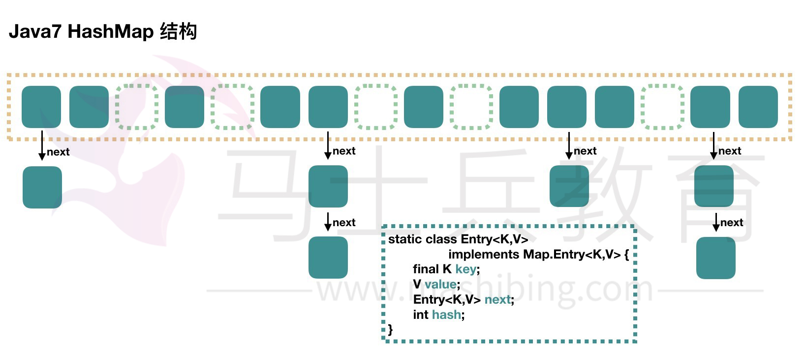
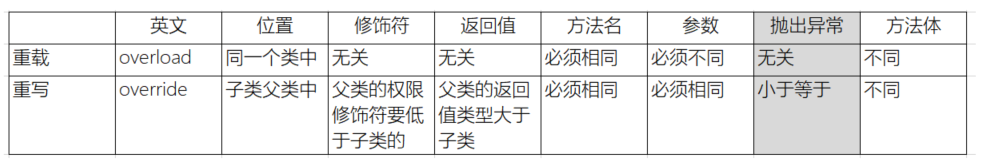
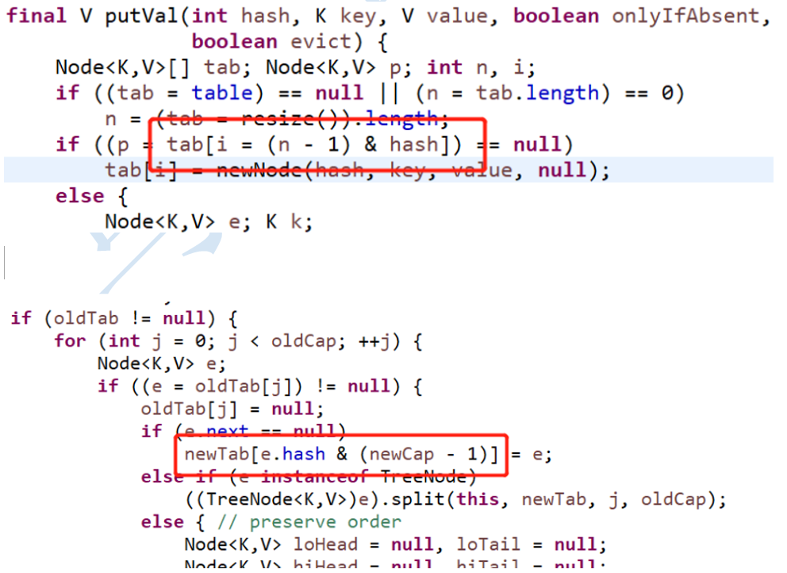
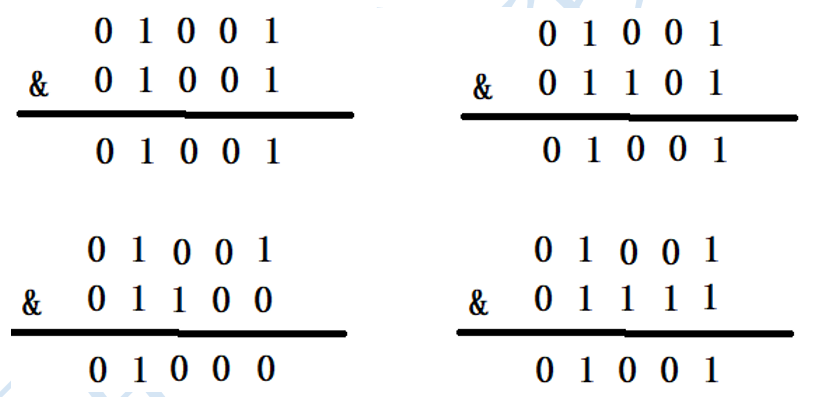
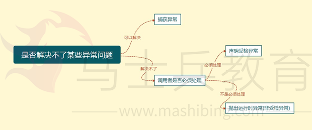

# **Java面向对象有哪些特征，如何应用**

​		面向对象编程是利用类和对象编程的一种思想。万物可归类，类是对于世界事物的高度抽象 ，不同的事物之间有不同的关系 ，一个类自身与外界的封装关系，一个父类和子类的继承关系， 一个类和多个类的多态关系。万物皆对象，对象是具体的世界事物，面向对象的三大特征封装，继承，多态。封装，封装说明一个类行为和属性与其他类的关系，低耦合，高内聚；继承是父类和子类的关系，多态说的是类与类的关系。

​		封装隐藏了类的内部实现机制，可以在不影响使用的情况下改变类的内部结构，同时也保护了数据。对外界而已它的内部细节是隐藏的，暴露给外界的只是它的访问方法。属性的封装：使用者只能通过事先定制好的方法来访问数据，可以方便地加入逻辑控制，限制对属性的 不合理操作；方法的封装：使用者按照既定的方式调用方法，不必关心方法的内部实现，便于使用； 便于修改，增强 代码的可维护性；

​		继承是从已有的类中派生出新的类，新的类能吸收已有类的数据属性和行为，并能扩展新的能力。在本质上是特殊~一般的关系，即常说的is-a关系。子类继承父类，表明子类是一种特殊的父类，并且具有父类所不具有的一些属性或方法。从多种实现类中抽象出一个基类，使其具备多种实现类的共同特性 ，当实现类用extends关键字继承了基类（父类）后，实现类就具备了这些相同的属性。继承的类叫做子类（派生类或者超类），被继承的类叫做父类（或者基类）。比如从猫类、狗类、虎类中可以抽象出一个动物类，具有和猫、狗、虎类的共同特性（吃、跑、叫等）。Java通过extends关键字来实现继承，父类中通过private定义的变量和方法不会被继承，不能在子类中直接操作父类通过private定义的变量以及方法。继承避免了对一般类和特殊类之间共同特征进行的重复描述，通过继承可以清晰地表达每一项共同特征所适应的概念范围，在一般类中定义的属性和操作适应于这个类本身以及它以下的每一层特殊类的全部对象。运用继承原则使得系统模型比较简练也比较清晰。

​		相比于封装和继承，Java多态是三大特性中比较难的一个，封装和继承最后归结于多态， 多态指的是类和类的关系，两个类由继承关系，存在有方法的重写，故而可以在调用时有父类引用指向子类对象。多态必备三个要素：继承，重写，父类引用指向子类对象。

# HashMap原理是什么，在jdk1.7和1.8中有什么区别

HashMap 根据键的 hashCode 值存储数据，大多数情况下可以直接定位到它的值，因而具有很快的访问速度，但遍历顺序却是不确定的。 HashMap最多只允许一条记录的键为null，允许多条记录的值为 null。HashMap 非线程安全，即任一时刻可以有多个线程同时写 HashMap，可能会导致数据的不一致。如果需要满足线程安全，可以用 Collections 的 synchronizedMap 方法使 HashMap 具有线程安全的能力，或者使用 ConcurrentHashMap。我们用下面这张图来介绍

HashMap 的结构。

**JAVA7** 实现 



大方向上，HashMap 里面是一个数组，然后数组中每个元素是一个单向链表。上图中，每个绿色

的实体是嵌套类 Entry 的实例，Entry 包含四个属性：key, value, hash 值和用于单向链表的 next。 

1. capacity：当前数组容量，始终保持 2^n，可以扩容，扩容后数组大小为当前的 2 倍。 

2. loadFactor：负载因子，默认为 0.75。 

3. threshold：扩容的阈值，等于 capacity * loadFactor 

**JAVA8实现 **

Java8 对 HashMap 进行了一些修改，最大的不同就是利用了红黑树，所以其由 数组+链表+红黑树 组成。 

根据 Java7 HashMap 的介绍，我们知道，查找的时候，根据 hash 值我们能够快速定位到数组的具体下标，但是之后的话，需要顺着链表一个个比较下去才能找到我们需要的，时间复杂度取决

于链表的长度，为 O(n)。为了降低这部分的开销，在 Java8 中，当链表中的元素超过了 8 个以后，会将链表转换为红黑树，在这些位置进行查找的时候可以降低时间复杂度为 O(logN)。 


# ArrayList和LinkedList有什么区别

ArrayList和LinkedList都实现了List接口，他们有以下的不同点：
ArrayList是基于索引的数据接口，它的底层是数组。它可以以O(1)时间复杂度对元素进行随机访问。与此对应，LinkedList是以元素列表的形式存储它的数据，每一个元素都和它的前一个和后一个元素链接在一起，在这种情况下，查找某个元素的时间复杂度是O(n)。
相对于ArrayList，LinkedList的插入，添加，删除操作速度更快，因为当元素被添加到集合任意位置的时候，不需要像数组那样重新计算大小或者是更新索引。
LinkedList比ArrayList更占内存，因为LinkedList为每一个节点存储了两个引用，一个指向前一个元素，一个指向下一个元素。
也可以参考ArrayList vs. LinkedList。

1) 因为 Array 是基于索引 (index) 的数据结构，它使用索引在数组中搜索和读取数据是很快的。 Array 获取数据的时间复杂度是 O(1), 但是要删除数据却是开销很大的，因为这需要重排数组中的所有数据。

2) 相对于 ArrayList ， LinkedList 插入是更快的。因为 LinkedList 不像 ArrayList 一样，不需要改变数组的大小，也不需要在数组装满的时候要将所有的数据重新装入一个新的数组，这是 ArrayList 最坏的一种情况，时间复杂度是 O(n) ，而 LinkedList 中插入或删除的时间复杂度仅为 O(1) 。 ArrayList 在插入数据时还需要更新索引（除了插入数组的尾部）。

3) 类似于插入数据，删除数据时， LinkedList 也优于 ArrayList 。

4) LinkedList 需要更多的内存，因为 ArrayList 的每个索引的位置是实际的数据，而 LinkedList 中的每个节点中存储的是实际的数据和前后节点的位置 ( 一个 LinkedList 实例存储了两个值： Node<E> first 和 Node<E> last 分别表示链表的其实节点和尾节点，每个 Node 实例存储了三个值： E item,Node next,Node pre) 。

什么场景下更适宜使用 LinkedList，而不用ArrayList

1) 你的应用不会随机访问数据 。因为如果你需要LinkedList中的第n个元素的时候，你需要从第一个元素顺序数到第n个数据，然后读取数据。

2) 你的应用更多的插入和删除元素，更少的读取数据 。因为插入和删除元素不涉及重排数据，所以它要比ArrayList要快。

换句话说，ArrayList的实现用的是数组，LinkedList是基于链表，ArrayList适合查找，LinkedList适合增删

 以上就是关于 ArrayList和LinkedList的差别。你需要一个不同步的基于索引的数据访问时，请尽量使用ArrayList。ArrayList很快，也很容易使用。但是要记得要给定一个合适的初始大小，尽可能的减少更改数组的大小。

#  高并发中的集合有哪些问题 

**第一代线程安全集合类 **

Vector、Hashtable 

是怎么保证线程安排的： 使用synchronized修饰方法*

缺点：效率低下 

**第二代线程非安全集合类**

ArrayList、HashMap

线程不安全，但是性能好，用来替代Vector、Hashtable             

使用ArrayList、HashMap，需要线程安全怎么办呢？ 

使用 Collections.*synchronizedList*(list); Collections.*synchronizedMap*(m); 

底层使用synchronized代码块锁 虽然也是锁住了所有的代码，但是锁在方法里边，并所在方法外边性能可以理解为稍有提高吧。毕竟进方法本身就要分配资源的 

 

**第三代线程安全集合类**

在大量并发情况下如何提高集合的效率和安全呢？ 

java.util.concurrent.* 

ConcurrentHashMap：

CopyOnWriteArrayList ：

CopyOnWriteArraySet：   注意 不是CopyOnWriteHashSet*

底层大都采用Lock锁（1.8的ConcurrentHashMap不使用Lock锁），保证安全的同时，性能也很高。       


#  jdk1.8的新特性有哪些 

### 一、接口的默认方法

Java 8允许我们给接口添加一个非抽象的方法实现，只需要使用 default关键字即可，这个特征又叫做扩展方法，示例如下：

代码如下:

interface Formula { double calculate(int a);

default double sqrt(int a) { return Math.sqrt(a); } }

Formula接口在拥有calculate方法之外同时还定义了sqrt方法，实现了Formula接口的子类只需要实现一个calculate方法，默认方法sqrt将在子类上可以直接使用。

代码如下:

Formula formula = new Formula() { @Override public double calculate(int a) { return sqrt(a * 100); } };

formula.calculate(100); // 100.0 formula.sqrt(16); // 4.0

文中的formula被实现为一个匿名类的实例，该代码非常容易理解，6行代码实现了计算 sqrt(a * 100)。在下一节中，我们将会看到实现单方法接口的更简单的做法。

译者注： 在Java中只有单继承，如果要让一个类赋予新的特性，通常是使用接口来实现，在C++中支持多继承，允许一个子类同时具有多个父类的接口与功能，在其他语言中，让一个类同时具有其他的可复用代码的方法叫做mixin。新的Java 8 的这个特新在编译器实现的角度上来说更加接近Scala的trait。 在C#中也有名为扩展方法的概念，允许给已存在的类型扩展方法，和Java 8的这个在语义上有差别。

### 二、Lambda 表达式

首先看看在老版本的Java中是如何排列字符串的：

代码如下:

List<String> names = Arrays.asList("peterF", "anna", "mike", "xenia");

Collections.sort(names, new Comparator<String>() { @Override public int compare(String a, String b) { return b.compareTo(a); } });

只需要给静态方法 Collections.sort 传入一个List对象以及一个比较器来按指定顺序排列。通常做法都是创建一个匿名的比较器对象然后将其传递给sort方法。

在Java 8 中你就没必要使用这种传统的匿名对象的方式了，Java 8提供了更简洁的语法，lambda表达式：

代码如下:

Collections.sort(names, (String a, String b) -> { return b.compareTo(a); });

看到了吧，代码变得更段且更具有可读性，但是实际上还可以写得更短：

代码如下:

Collections.sort(names, (String a, String b) -> b.compareTo(a));

对于函数体只有一行代码的，你可以去掉大括号{}以及return关键字，但是你还可以写得更短点：

代码如下:

Collections.sort(names, (a, b) -> b.compareTo(a));

Java编译器可以自动推导出参数类型，所以你可以不用再写一次类型。接下来我们看看lambda表达式还能作出什么更方便的东西来：

### 三、函数式接口

Lambda表达式是如何在java的类型系统中表示的呢？每一个lambda表达式都对应一个类型，通常是接口类型。而“函数式接口”是指仅仅只包含一个抽象方法的接口，每一个该类型的lambda表达式都会被匹配到这个抽象方法。因为 默认方法 不算抽象方法，所以你也可以给你的函数式接口添加默认方法。

我们可以将lambda表达式当作任意只包含一个抽象方法的接口类型，确保你的接口一定达到这个要求，你只需要给你的接口添加 @FunctionalInterface 注解，编译器如果发现你标注了这个注解的接口有多于一个抽象方法的时候会报错的。

示例如下：

代码如下:

@FunctionalInterface interface Converter<F, T> { T convert(F from); } Converter<String, Integer> converter = (from) -> Integer.valueOf(from); Integer converted = converter.convert("123"); System.out.println(converted); // 123

需要注意如果@FunctionalInterface如果没有指定，上面的代码也是对的。

译者注 将lambda表达式映射到一个单方法的接口上，这种做法在Java 8之前就有别的语言实现，比如Rhino JavaScript解释器，如果一个函数参数接收一个单方法的接口而你传递的是一个function，Rhino 解释器会自动做一个单接口的实例到function的适配器，典型的应用场景有 org.w3c.dom.events.EventTarget 的addEventListener 第二个参数 EventListener。

### 四、方法与构造函数引用

前一节中的代码还可以通过静态方法引用来表示：

代码如下:

Converter<String, Integer> converter = Integer::valueOf; Integer converted = converter.convert("123"); System.out.println(converted); // 123

Java 8 允许你使用 :: 关键字来传递方法或者构造函数引用，上面的代码展示了如何引用一个静态方法，我们也可以引用一个对象的方法：

代码如下:

converter = something::startsWith; String converted = converter.convert("Java"); System.out.println(converted); // "J"

接下来看看构造函数是如何使用::关键字来引用的，首先我们定义一个包含多个构造函数的简单类：

代码如下:

class Person { String firstName; String lastName;

Person() {}

Person(String firstName, String lastName) { this.firstName = firstName; this.lastName = lastName; } }

接下来我们指定一个用来创建Person对象的对象工厂接口：

代码如下:

interface PersonFactory<P extends Person> { P create(String firstName, String lastName); }

这里我们使用构造函数引用来将他们关联起来，而不是实现一个完整的工厂：

代码如下:

PersonFactory<Person> personFactory = Person::new; Person person = personFactory.create("Peter", "Parker");

我们只需要使用 Person::new 来获取Person类构造函数的引用，Java编译器会自动根据PersonFactory.create方法的签名来选择合适的构造函数。

### 五、Lambda 作用域

在lambda表达式中访问外层作用域和老版本的匿名对象中的方式很相似。你可以直接访问标记了final的外层局部变量，或者实例的字段以及静态变量。

### 六、访问局部变量

我们可以直接在lambda表达式中访问外层的局部变量：

代码如下:

final int num = 1; Converter<Integer, String> stringConverter = (from) -> String.valueOf(from + num);

stringConverter.convert(2); // 3

但是和匿名对象不同的是，这里的变量num可以不用声明为final，该代码同样正确：

代码如下:

int num = 1; Converter<Integer, String> stringConverter = (from) -> String.valueOf(from + num);

stringConverter.convert(2); // 3

不过这里的num必须不可被后面的代码修改（即隐性的具有final的语义），例如下面的就无法编译：

代码如下:

int num = 1; Converter<Integer, String> stringConverter = (from) -> String.valueOf(from + num); num = 3;

在lambda表达式中试图修改num同样是不允许的。

### 七、访问对象字段与静态变量

和本地变量不同的是，lambda内部对于实例的字段以及静态变量是即可读又可写。该行为和匿名对象是一致的：

代码如下:

class Lambda4 { static int outerStaticNum; int outerNum;

void testScopes() { Converter<Integer, String> stringConverter1 = (from) -> { outerNum = 23; return String.valueOf(from); };

Converter<Integer, String> stringConverter2 = (from) -> {  outerStaticNum = 72;  return String.valueOf(from);  }; } }

### 八、访问接口的默认方法

还记得第一节中的formula例子么，接口Formula定义了一个默认方法sqrt可以直接被formula的实例包括匿名对象访问到，但是在lambda表达式中这个是不行的。 Lambda表达式中是无法访问到默认方法的，以下代码将无法编译：

代码如下:

Formula formula = (a) -> sqrt( a * 100); Built-in Functional Interfaces

JDK 1.8 API包含了很多内建的函数式接口，在老Java中常用到的比如Comparator或者Runnable接口，这些接口都增加了@FunctionalInterface注解以便能用在lambda上。 Java 8 API同样还提供了很多全新的函数式接口来让工作更加方便，有一些接口是来自Google Guava库里的，即便你对这些很熟悉了，还是有必要看看这些是如何扩展到lambda上使用的。

**Predicate****接口**

Predicate 接口只有一个参数，返回boolean类型。该接口包含多种默认方法来将Predicate组合成其他复杂的逻辑（比如：与，或，非）：

代码如下:

Predicate<String> predicate = (s) -> s.length() > 0;

predicate.test("foo"); // true predicate.negate().test("foo"); // false

Predicate<Boolean> nonNull = Objects::nonNull; Predicate<Boolean> isNull = Objects::isNull;

Predicate<String> isEmpty = String::isEmpty; Predicate<String> isNotEmpty = isEmpty.negate();

**Function** **接口**

Function 接口有一个参数并且返回一个结果，并附带了一些可以和其他函数组合的默认方法（compose, andThen）：

代码如下:

Function<String, Integer> toInteger = Integer::valueOf; Function<String, String> backToString = toInteger.andThen(String::valueOf);

backToString.apply("123"); // "123"

**Supplier** **接口** Supplier 接口返回一个任意范型的值，和Function接口不同的是该接口没有任何参数

代码如下:

Supplier<Person> personSupplier = Person::new; personSupplier.get(); // new Person

**Consumer** **接口** Consumer 接口表示执行在单个参数上的操作。

代码如下:

Consumer<Person> greeter = (p) -> System.out.println("Hello, " + p.firstName); greeter.accept(new Person("Luke", "Skywalker"));

**Comparator** **接口** Comparator 是老Java中的经典接口， Java 8在此之上添加了多种默认方法：

代码如下:

Comparator<Person> comparator = (p1, p2) -> p1.firstName.compareTo(p2.firstName);

Person p1 = new Person("John", "Doe"); Person p2 = new Person("Alice", "Wonderland");

comparator.compare(p1, p2); // > 0 comparator.reversed().compare(p1, p2); // < 0

**Optional** **接口**

Optional 不是函数是接口，这是个用来防止NullPointerException异常的辅助类型，这是下一届中将要用到的重要概念，现在先简单的看看这个接口能干什么：

Optional 被定义为一个简单的容器，其值可能是null或者不是null。在Java 8之前一般某个函数应该返回非空对象但是偶尔却可能返回了null，而在Java 8中，不推荐你返回null而是返回Optional。

代码如下:

Optional<String> optional = Optional.of("bam");

optional.isPresent(); // true optional.get(); // "bam" optional.orElse("fallback"); // "bam"

optional.ifPresent((s) -> System.out.println(s.charAt(0))); // "b"

**Stream** **接口**

java.util.Stream 表示能应用在一组元素上一次执行的操作序列。Stream 操作分为中间操作或者最终操作两种，最终操作返回一特定类型的计算结果，而中间操作返回Stream本身，这样你就可以将多个操作依次串起来。Stream 的创建需要指定一个数据源，比如 java.util.Collection的子类，List或者Set， Map不支持。Stream的操作可以串行执行或者并行执行。

首先看看Stream是怎么用，首先创建实例代码的用到的数据List：

代码如下:

List<String> stringCollection = new ArrayList<>(); stringCollection.add("ddd2"); stringCollection.add("aaa2"); stringCollection.add("bbb1"); stringCollection.add("aaa1"); stringCollection.add("bbb3"); stringCollection.add("ccc"); stringCollection.add("bbb2"); stringCollection.add("ddd1");

Java 8扩展了集合类，可以通过 Collection.stream() 或者 Collection.parallelStream() 来创建一个Stream。下面几节将详细解释常用的Stream操作：

**Filter** **过滤**

过滤通过一个predicate接口来过滤并只保留符合条件的元素，该操作属于中间操作，所以我们可以在过滤后的结果来应用其他Stream操作（比如forEach）。forEach需要一个函数来对过滤后的元素依次执行。forEach是一个最终操作，所以我们不能在forEach之后来执行其他Stream操作。

代码如下:

stringCollection .stream() .filter((s) -> s.startsWith("a")) .forEach(System.out::println);

// "aaa2", "aaa1"

**Sort** **排序**

排序是一个中间操作，返回的是排序好后的Stream。如果你不指定一个自定义的Comparator则会使用默认排序。

代码如下:

stringCollection .stream() .sorted() .filter((s) -> s.startsWith("a")) .forEach(System.out::println);

// "aaa1", "aaa2"

需要注意的是，排序只创建了一个排列好后的Stream，而不会影响原有的数据源，排序之后原数据stringCollection是不会被修改的：

代码如下:

System.out.println(stringCollection); // ddd2, aaa2, bbb1, aaa1, bbb3, ccc, bbb2, ddd1

**Map** **映射** 中间操作map会将元素根据指定的Function接口来依次将元素转成另外的对象，下面的示例展示了将字符串转换为大写字符串。你也可以通过map来讲对象转换成其他类型，map返回的Stream类型是根据你map传递进去的函数的返回值决定的。

代码如下:

stringCollection .stream() .map(String::toUpperCase) .sorted((a, b) -> b.compareTo(a)) .forEach(System.out::println);

// "DDD2", "DDD1", "CCC", "BBB3", "BBB2", "AAA2", "AAA1"

**Match** **匹配**

Stream提供了多种匹配操作，允许检测指定的Predicate是否匹配整个Stream。所有的匹配操作都是最终操作，并返回一个boolean类型的值。

代码如下:

boolean anyStartsWithA = stringCollection .stream() .anyMatch((s) -> s.startsWith("a"));

System.out.println(anyStartsWithA); // true

boolean allStartsWithA = stringCollection .stream() .allMatch((s) -> s.startsWith("a"));

System.out.println(allStartsWithA); // false

boolean noneStartsWithZ = stringCollection .stream() .noneMatch((s) -> s.startsWith("z"));

System.out.println(noneStartsWithZ); // true

**Count** **计数** 计数是一个最终操作，返回Stream中元素的个数，返回值类型是long。

代码如下:

long startsWithB = stringCollection .stream() .filter((s) -> s.startsWith("b")) .count();

System.out.println(startsWithB); // 3

**Reduce** **规约**

这是一个最终操作，允许通过指定的函数来讲stream中的多个元素规约为一个元素，规越后的结果是通过Optional接口表示的：

代码如下:

Optional<String> reduced = stringCollection .stream() .sorted() .reduce((s1, s2) -> s1 + "#" + s2);

reduced.ifPresent(System.out::println); // "aaa1#aaa2#bbb1#bbb2#bbb3#ccc#ddd1#ddd2"

**并行****Streams**

前面提到过Stream有串行和并行两种，串行Stream上的操作是在一个线程中依次完成，而并行Stream则是在多个线程上同时执行。

下面的例子展示了是如何通过并行Stream来提升性能：

首先我们创建一个没有重复元素的大表：

代码如下:

int max = 1000000; List<String> values = new ArrayList<>(max); for (int i = 0; i < max; i++) { UUID uuid = UUID.randomUUID(); values.add(uuid.toString()); }

然后我们计算一下排序这个Stream要耗时多久， 串行排序：

代码如下:

long t0 = System.nanoTime();

long count = values.stream().sorted().count(); System.out.println(count);

long t1 = System.nanoTime();

long millis = TimeUnit.NANOSECONDS.toMillis(t1 - t0); System.out.println(String.format("sequential sort took: %d ms", millis));

// 串行耗时: 899 ms 并行排序：

代码如下:

long t0 = System.nanoTime();

long count = values.parallelStream().sorted().count(); System.out.println(count);

long t1 = System.nanoTime();

long millis = TimeUnit.NANOSECONDS.toMillis(t1 - t0); System.out.println(String.format("parallel sort took: %d ms", millis));

// 并行排序耗时: 472 ms 上面两个代码几乎是一样的，但是并行版的快了50%之多，唯一需要做的改动就是将stream()改为parallelStream()。

**Map**

前面提到过，Map类型不支持stream，不过Map提供了一些新的有用的方法来处理一些日常任务。

代码如下:

Map<Integer, String> map = new HashMap<>();

for (int i = 0; i < 10; i++) { map.putIfAbsent(i, "val" + i); }

map.forEach((id, val) -> System.out.println(val)); 以上代码很容易理解， putIfAbsent 不需要我们做额外的存在性检查，而forEach则接收一个Consumer接口来对map里的每一个键值对进行操作。

下面的例子展示了map上的其他有用的函数：

代码如下:

map.computeIfPresent(3, (num, val) -> val + num); map.get(3); // val33

map.computeIfPresent(9, (num, val) -> null); map.containsKey(9); // false

map.computeIfAbsent(23, num -> "val" + num); map.containsKey(23); // true

map.computeIfAbsent(3, num -> "bam"); map.get(3); // val33

接下来展示如何在Map里删除一个键值全都匹配的项：

代码如下:

map.remove(3, "val3"); map.get(3); // val33

map.remove(3, "val33"); map.get(3); // null

另外一个有用的方法：

代码如下:

map.getOrDefault(42, "not found"); // not found

对Map的元素做合并也变得很容易了：

代码如下:

map.merge(9, "val9", (value, newValue) -> value.concat(newValue)); map.get(9); // val9

map.merge(9, "concat", (value, newValue) -> value.concat(newValue)); map.get(9); // val9concat

Merge做的事情是如果键名不存在则插入，否则则对原键对应的值做合并操作并重新插入到map中。

### 九、Date API

Java 8 在包java.time下包含了一组全新的时间日期API。新的日期API和开源的Joda-Time库差不多，但又不完全一样，下面的例子展示了这组新API里最重要的一些部分：

**Clock** **时钟**

Clock类提供了访问当前日期和时间的方法，Clock是时区敏感的，可以用来取代 System.currentTimeMillis() 来获取当前的微秒数。某一个特定的时间点也可以使用Instant类来表示，Instant类也可以用来创建老的java.util.Date对象。

代码如下:

Clock clock = Clock.systemDefaultZone(); long millis = clock.millis();

Instant instant = clock.instant(); Date legacyDate = Date.from(instant); // legacy java.util.Date

**Timezones** **时区**

在新API中时区使用ZoneId来表示。时区可以很方便的使用静态方法of来获取到。 时区定义了到UTS时间的时间差，在Instant时间点对象到本地日期对象之间转换的时候是极其重要的。

代码如下:

System.out.println(ZoneId.getAvailableZoneIds()); // prints all available timezone ids

ZoneId zone1 = ZoneId.of("Europe/Berlin"); ZoneId zone2 = ZoneId.of("Brazil/East"); System.out.println(zone1.getRules()); System.out.println(zone2.getRules());

// ZoneRules[currentStandardOffset=+01:00] // ZoneRules[currentStandardOffset=-03:00]

**LocalTime** **本地时间**

LocalTime 定义了一个没有时区信息的时间，例如 晚上10点，或者 17:30:15。下面的例子使用前面代码创建的时区创建了两个本地时间。之后比较时间并以小时和分钟为单位计算两个时间的时间差：

代码如下:

LocalTime now1 = LocalTime.now(zone1); LocalTime now2 = LocalTime.now(zone2);

System.out.println(now1.isBefore(now2)); // false

long hoursBetween = ChronoUnit.HOURS.between(now1, now2); long minutesBetween = ChronoUnit.MINUTES.between(now1, now2);

System.out.println(hoursBetween); // -3 System.out.println(minutesBetween); // -239

LocalTime 提供了多种工厂方法来简化对象的创建，包括解析时间字符串。

代码如下:

LocalTime late = LocalTime.of(23, 59, 59); System.out.println(late); // 23:59:59

DateTimeFormatter germanFormatter = DateTimeFormatter .ofLocalizedTime(FormatStyle.SHORT) .withLocale(Locale.GERMAN);

LocalTime leetTime = LocalTime.parse("13:37", germanFormatter); System.out.println(leetTime); // 13:37

**LocalDate** **本地日期**

LocalDate 表示了一个确切的日期，比如 2014-03-11。该对象值是不可变的，用起来和LocalTime基本一致。下面的例子展示了如何给Date对象加减天/月/年。另外要注意的是这些对象是不可变的，操作返回的总是一个新实例。

代码如下:

LocalDate today = LocalDate.now(); LocalDate tomorrow = today.plus(1, ChronoUnit.DAYS); LocalDate yesterday = tomorrow.minusDays(2);

LocalDate independenceDay = LocalDate.of(2014, Month.JULY, 4); DayOfWeek dayOfWeek = independenceDay.getDayOfWeek();

System.out.println(dayOfWeek); // FRIDAY 从字符串解析一个LocalDate类型和解析LocalTime一样简单：

代码如下:

DateTimeFormatter germanFormatter = DateTimeFormatter .ofLocalizedDate(FormatStyle.MEDIUM) .withLocale(Locale.GERMAN);

LocalDate xmas = LocalDate.parse("24.12.2014", germanFormatter); System.out.println(xmas); // 2014-12-24

**LocalDateTime** **本地日期时间**

LocalDateTime 同时表示了时间和日期，相当于前两节内容合并到一个对象上了。LocalDateTime和LocalTime还有LocalDate一样，都是不可变的。LocalDateTime提供了一些能访问具体字段的方法。

代码如下:

LocalDateTime sylvester = LocalDateTime.of(2014, Month.DECEMBER, 31, 23, 59, 59);

DayOfWeek dayOfWeek = sylvester.getDayOfWeek(); System.out.println(dayOfWeek); // WEDNESDAY

Month month = sylvester.getMonth(); System.out.println(month); // DECEMBER

long minuteOfDay = sylvester.getLong(ChronoField.MINUTE_OF_DAY); System.out.println(minuteOfDay); // 1439

只要附加上时区信息，就可以将其转换为一个时间点Instant对象，Instant时间点对象可以很容易的转换为老式的java.util.Date。

代码如下:

Instant instant = sylvester .atZone(ZoneId.systemDefault()) .toInstant();

Date legacyDate = Date.from(instant); System.out.println(legacyDate); // Wed Dec 31 23:59:59 CET 2014

格式化LocalDateTime和格式化时间和日期一样的，除了使用预定义好的格式外，我们也可以自己定义格式：

代码如下:

DateTimeFormatter formatter = DateTimeFormatter .ofPattern("MMM dd, yyyy - HH:mm");

LocalDateTime parsed = LocalDateTime.parse("Nov 03, 2014 - 07:13", formatter); String string = formatter.format(parsed); System.out.println(string); // Nov 03, 2014 - 07:13

和java.text.NumberFormat不一样的是新版的DateTimeFormatter是不可变的，所以它是线程安全的。

### 十、Annotation 注解

在Java 8中支持多重注解了，先看个例子来理解一下是什么意思。 首先定义一个包装类Hints注解用来放置一组具体的Hint注解：

代码如下:

@interface Hints { Hint[] value(); }

@Repeatable(Hints.class) @interface Hint { String value(); }

Java 8允许我们把同一个类型的注解使用多次，只需要给该注解标注一下@Repeatable即可。

例 1: 使用包装类当容器来存多个注解（老方法）

代码如下:

@Hints({@Hint("hint1"), @Hint("hint2")}) class Person {}

例 2：使用多重注解（新方法）

代码如下:

@Hint("hint1") @Hint("hint2") class Person {}

第二个例子里java编译器会隐性的帮你定义好@Hints注解，了解这一点有助于你用反射来获取这些信息：

代码如下:

Hint hint = Person.class.getAnnotation(Hint.class); System.out.println(hint); // null

Hints hints1 = Person.class.getAnnotation(Hints.class); System.out.println(hints1.value().length); // 2

Hint[] hints2 = Person.class.getAnnotationsByType(Hint.class); System.out.println(hints2.length); // 2

即便我们没有在Person类上定义@Hints注解，我们还是可以通过 getAnnotation(Hints.class) 来获取 @Hints注解，更加方便的方法是使用 getAnnotationsByType 可以直接获取到所有的@Hint注解。 另外Java 8的注解还增加到两种新的target上了：

代码如下:

@Target({ElementType.TYPE_PARAMETER, ElementType.TYPE_USE}) @interface MyAnnotation {}

关于Java 8的新特性就写到这了，肯定还有更多的特性等待发掘。JDK 1.8里还有很多很有用的东西，比如Arrays.parallelSort, StampedLock和CompletableFuture等等。

# Java中重写和重载有哪些区别

方法的重载和重写都是实现多态的方式，区别在于前者实现的是编译时的多态性，而后者实现的是运行时的多态

性。重载发生在一个类中，同名的方法如果有不同的参数列表（参数类型不同、参数个数不同或者二者都不同）则视为

重载；重写发生在子类与父类之间，重写要求子类被重写方法与父类被重写方法有相同的返回类型，比父类被重写方

法更好访问，不能比父类被重写方法声明更多的异常（里氏代换原则）。重载对返回类型没有特殊的要求。

方法重载的规则：

1.方法名一致，参数列表中参数的顺序，类型，个数不同。

2.重载与方法的返回值无关，存在于父类和子类，同类中。

3.可以抛出不同的异常，可以有不同修饰符


方法重写的规则：

1.参数列表必须完全与被重写方法的一致，返回类型必须完全与被重写方法的返回类型一致。

2.构造方法不能被重写，声明为 final 的方法不能被重写，声明为 static 的方法不能被重写，但是能够被再次

声明。

3.访问权限不能比父类中被重写的方法的访问权限更低。

4.重写的方法能够抛出任何非强制异常（UncheckedException，也叫非运行时异常），无论被重写的方法是

否抛出异常。但是，重写的方法不能抛出新的强制性异常，或者比被重写方法声明的更广泛的强制性异常，反之则

可以。



# 接口和抽象类有哪些区别

不同：

抽象类：

1.抽象类中可以定义构造器

2.可以有抽象方法和具体方法

3.接口中的成员全都是 public 的

4.抽象类中可以定义成员变量

5.有抽象方法的类必须被声明为抽象类，而抽象类未必要有抽象方法

6.抽象类中可以包含静态方法

7.一个类只能继承一个抽象类

接口：

1.接口中不能定义构造器

2.方法全部都是抽象方法

3.抽象类中的成员可以是 private、默认、protected、public

4.接口中定义的成员变量实际上都是常量

5.接口中不能有静态方法

6.一个类可以实现多个接口

相同：

1.不能够实例化

2.可以将抽象类和接口类型作为引用类型

3.一个类如果继承了某个抽象类或者实现了某个接口都需要对其中的抽象方法全部进行实现，否则该类仍然需要

被声明为抽象类

# 怎样声明一个类不会被继承，什么场景下会用

如果一个类被final修饰，此类不可以有子类，不能被其它类继承，如果一个中的所有方法都没有重写的需要，当前类没有子类也罢，就可以使用final修饰类。

# Java中==和equals有哪些区别

equals 和== 最大的区别是一个是方法一个是运算符。

==：如果比较的对象是基本数据类型，则比较的是数值是否相等；如果比较的是引用数据类型，则比较的是对象

的地址值是否相等。

equals()：用来比较方法两个对象的内容是否相等。

注意：equals 方法不能用于基本数据类型的变量，如果没有对 equals 方法进行重写，则比较的是引用类型的变

量所指向的对象的地址。


# String、StringBuffer、StringBuilder区别及使用场景

Java 平台提供了两种类型的字符串：String 和 StringBuffer/StringBuilder，它们都可以储存和操作字符串，区别

如下。

1）String 是只读字符串，也就意味着 String 引用的字符串内容是不能被改变的。初学者可能会有这样的误解：

```
String str = “abc”；
str = “bcd”;
```

如上，字符串 str 明明是可以改变的呀！其实不然，str 仅仅是一个引用对象，它指向一个字符串对象“abc”。第

二行代码的含义是让 str 重新指向了一个新的字符串“bcd”对象，而“abc”对象并没有任何改变，只不过该对象已

经成为一个不可及对象罢了。

2）StringBuffer/StringBuilder 表示的字符串对象可以直接进行修改。

3）StringBuilder 是 Java5 中引入的，它和 StringBuffer 的方法完全相同，区别在于它是在单线程环境下使用的，

因为它的所有方法都没有被 synchronized 修饰，因此它的效率理论上也比 StringBuffer 要高。


#  Java代理的几种实现方式 


第一种:静态代理,只能静态的代理某些类或者某些方法,不推荐使用,功能比较弱,但是编码简单

第二种:动态代理,包含Proxy代理和CGLIB动态代理

## Proxy代理是JDK内置的动态代理

​         特点:面向接口的,不需要导入三方依赖的动态代理,可以对多个不同的接口进行增强,通过反射读取注解时,只能读取到接口上的注解

​         原理:面向接口,只能对实现类在实现接口中定义的方法进行增强

定义接口和实现

```
package com.proxy;

public interface UserService {
    public String getName(int id);

    public Integer getAge(int id);
}
```

```
package com.proxy;

public class UserServiceImpl implements UserService {
    @Override
    public String getName(int id) {
        System.out.println("------getName------");
        return "riemann";
    }

    @Override
    public Integer getAge(int id) {
        System.out.println("------getAge------");
        return 26;
    }
}
```

```
package com.proxy;

import java.lang.reflect.InvocationHandler;
import java.lang.reflect.Method;

public class MyInvocationHandler implements InvocationHandler {

    public Object target;

    MyInvocationHandler() {
        super();
    }

    MyInvocationHandler(Object target) {
        super();
        this.target = target;
    }

    @Override
    public Object invoke(Object proxy, Method method, Object[] args) throws Throwable {
        if ("getName".equals(method.getName())) {
            System.out.println("++++++before " + method.getName() + "++++++");
            Object result = method.invoke(target, args);
            System.out.println("++++++after " + method.getName() + "++++++");
            return result;
        } else {
            Object result = method.invoke(target, args);
            return result;
        }
    }
}
```

```
package com.proxy;

import java.lang.reflect.InvocationHandler;
import java.lang.reflect.Proxy;

public class Main1 {
    public static void main(String[] args) {
        UserService userService = new UserServiceImpl();
        InvocationHandler invocationHandler = new MyInvocationHandler(userService);
        UserService userServiceProxy = (UserService) Proxy.newProxyInstance(userService.getClass().getClassLoader(),
                userService.getClass().getInterfaces(),invocationHandler);
        System.out.println(userServiceProxy.getName(1));
        System.out.println(userServiceProxy.getAge(1));
    }
}
```


## CGLIB动态代理

​        特点:面向父类的动态代理,需要导入第三方依赖

​        原理:面向父类,底层通过子类继承父类并重写方法的形式实现增强

Proxy和CGLIB是非常重要的代理模式,是springAOP底层实现的主要两种方式

CGLIB的核心类：
net.sf.cglib.proxy.Enhancer – 主要的增强类
net.sf.cglib.proxy.MethodInterceptor – 主要的方法拦截类，它是Callback接口的子接口，需要用户实现
net.sf.cglib.proxy.MethodProxy – JDK的java.lang.reflect.Method类的代理类，可以方便的实现对源对象方法的调用,如使用：
Object o = methodProxy.invokeSuper(proxy, args);//虽然第一个参数是被代理对象，也不会出现死循环的问题。

net.sf.cglib.proxy.MethodInterceptor接口是最通用的回调（callback）类型，它经常被基于代理的AOP用来实现拦截（intercept）方法的调用。这个接口只定义了一个方法
public Object intercept(Object object, java.lang.reflect.Method method,
Object[] args, MethodProxy proxy) throws Throwable;

第一个参数是代理对像，第二和第三个参数分别是拦截的方法和方法的参数。原来的方法可能通过使用java.lang.reflect.Method对象的一般反射调用，或者使用 net.sf.cglib.proxy.MethodProxy对象调用。net.sf.cglib.proxy.MethodProxy通常被首选使用，因为它更快。

```
package com.proxy.cglib;

import net.sf.cglib.proxy.MethodInterceptor;
import net.sf.cglib.proxy.MethodProxy;
import java.lang.reflect.Method;
 
public class CglibProxy implements MethodInterceptor {
    @Override
    public Object intercept(Object o, Method method, Object[] args, MethodProxy methodProxy) throws Throwable {
        System.out.println("++++++before " + methodProxy.getSuperName() + "++++++");
        System.out.println(method.getName());
        Object o1 = methodProxy.invokeSuper(o, args);
        System.out.println("++++++before " + methodProxy.getSuperName() + "++++++");
        return o1;
    }
}

```

```
package com.proxy.cglib;
 
import com.test3.service.UserService;
import com.test3.service.impl.UserServiceImpl;
import net.sf.cglib.proxy.Enhancer;
 
public class Main2 {
    public static void main(String[] args) {
        CglibProxy cglibProxy = new CglibProxy();
 
        Enhancer enhancer = new Enhancer();
        enhancer.setSuperclass(UserServiceImpl.class);
        enhancer.setCallback(cglibProxy);
 
        UserService o = (UserService)enhancer.create();
        o.getName(1);
        o.getAge(1);
    }
}
```

#  hashcode和equals如何使用 

equals()源自于java.lang.Object,该方法用来简单验证两个对象的相等性。Object类中定义的默认实现只检查两个对象的对象引用，以验证它们的相等性。 通过重写该方法,可以自定义验证对象相等新的规则,如果你使用ORM处理一些对象的话，你要确保在hashCode()和equals()对象中使用getter和setter而不是直接引用成员变量 

hashCode()源自于java.lang.Object ,该方法用于获取给定对象的唯一的整数(散列码)。当这个对象需要存储在哈希表这样的数据结构时，这个整数用于确定桶的位置。默认情况下，对象的hashCode()方法返回对象所在内存地址的整数表示。hashCode()是HashTable、HashMap和HashSet使用的。默认的，Object类的hashCode()方法返回这个对象存储的内存地址的编号。

hash散列算法,使得在hash表中查找一个记录速度变O(1). 每个记录都有自己的hashcode,散列算法按照hashcode把记录放置在合适的位置. 在查找一个记录,首先先通过hashcode快速定位记录的位置.然后再通过equals来比较是否相等。如果hashcode没找到，则不equal，元素不存在于哈希表中；即使找到了，也只需执行hashcode相同的几个元素的equal，如果不equal，还是不存在哈希表中。


# HashMap和HashTable的区别及底层实现 

## HashMap和HashTable对比

1. HashTable线程同步，HashMap非线程同步。
2. HashTable不允许<键,值>有空值，HashMap允许<键,值>有空值。
3. HashTable使用Enumeration，HashMap使用Iterator。
4. HashTable中hash数组的默认大小是11，增加方式的old*2+1，HashMap中hash数组的默认大小是16，增长方式是2的指数倍。

5.HashMap jdk1.8之前list + 链表 jdk1.8之后list + 链表,当链表长度到8时，转化为红黑树

6.HashMap链表插入节点的方式 在Java1.7中，插入链表节点使用**头插法**。Java1.8中变成了**尾插法**  

7.Java1.8的hash()中，将hash值高位（前16位）参与到取模的运算中，使得计算结果的不确定性增强，降低发生哈希碰撞的概率

## HashMap扩容优化:

扩容以后,1.7对元素进行rehash算法,计算原来每个元素在扩容之后的哈希表中的位置,1.8借助2倍扩容机制,元素不需要进行重新计算位置

JDK 1.8 在扩容时并没有像 JDK 1.7 那样，重新计算每个元素的哈希值，而是通过高位运算**（e.hash & oldCap）**来确定元素是否需要移动，比如 key1 的信息如下：


使用 e.hash & oldCap 得到的结果，高一位为 0，当结果为 0 时表示元素在扩容时位置不会发生任何变化，而 key 2 信息如下


 

  

高一位为 1，当结果为 1 时，表示元素在扩容时位置发生了变化，新的下标位置等于原下标位置 + 原数组长度**hashmap,****不必像1.7一样全部重新计算位置**


## 为什么hashmap扩容的时候是两倍？

查看源代码

在存入元素时,放入元素位置有一个 (n-1)&hash 的一个算法,和hash&(newCap-1),这里用到了一个&位运算符



 

  

当HashMap的容量是16时，它的二进制是10000，(n-1)的二进制是01111，与hash值得计算结果如下


下面就来看一下HashMap的容量不是2的n次幂的情况，当容量为10时，二进制为01010，(n-1)的二进制是01001，向里面添加同样的元素，结果为



可以看出，有三个不同的元素进过&运算得出了同样的结果，严重的hash碰撞了

只有当n的值是2的N次幂的时候，进行&位运算的时候，才可以只看后几位，而不需要全部进行计算

## hashmap线程安全的方式？

HashMap不是线程安全的,往往在写程序时需要通过一些方法来回避.其实JDK原生的提供了2种方法让HashMap支持线程安全.

方法一:通过Collections.synchronizedMap()返回一个新的Map,这个新的map就是线程安全的. 这个要求大家习惯基于接口编程,因为返回的并不是HashMap,而是一个Map的实现.

方法二:重新改写了HashMap,具体的可以查看java.util.concurrent.ConcurrentHashMap. 这个方法比方法一有了很大的改进.


方法一特点: 

通过Collections.synchronizedMap()来封装所有不安全的HashMap的方法,就连toString, hashCode都进行了封装. 封装的关键点有2处,1)使用了经典的synchronized来进行互斥, 2)使用了代理模式new了一个新的类,这个类同样实现了Map接口.在Hashmap上面,synchronized锁住的是对象,所以第一个申请的得到锁,其他线程将进入阻塞,等待唤醒. 优点:代码实现十分简单,一看就懂.缺点:从锁的角度来看,方法一直接使用了锁住方法,基本上是锁住了尽可能大的代码块.性能会比较差.

方法二特点:

重新写了HashMap,比较大的改变有如下几点.使用了新的锁机制,把HashMap进行了拆分,拆分成了多个独立的块,这样在高并发的情况下减少了锁冲突的可能,使用的是NonfairSync. 这个特性调用CAS指令来确保原子性与互斥性.当如果多个线程恰好操作到同一个segment上面,那么只会有一个线程得到运行.

优点:需要互斥的代码段比较少,性能会比较好. ConcurrentHashMap把整个Map切分成了多个块,发生锁碰撞的几率大大降低,性能会比较好. 缺点:代码繁琐


# Java异常处理方式


Java 通过面向对象的方法进行异常处理，一旦方法抛出异常，系统自动根据该异常对象寻找合适异常处理器（Exception Handler）来处理该异常，把各种不同的异常进行分类，并提供了良好的接口。在 Java 中，每个异常都是一个对

象，它是 Throwable 类或其子类的实例。当一个方法出现异常后便抛出一个异常对象，该对象中包含有异常信息，调用这个对象的方法可以捕获到这个异常并可以对其进行处理。Java 的异常处理是通过 5 个关键词来实现的：try、 catch、throw、throws 和 finally。

在Java应用中，异常的处理机制分为声明异常，抛出异常和捕获异常。

throw和throws的区别：
（1）位置不同：
throw：方法内部
throws: 方法的签名处，方法的声明处

（2）内容不同：
throw+异常对象（检查异常，运行时异常）
throws+异常的类型（可以多个类型，用，拼接）

（3）作用不同：
throw：异常出现的源头，制造异常。
throws:在方法的声明处，告诉方法的调用者，这个方法中可能会出现我声明的这些异常。然后调用者对这个异常进行处理：
要么自己处理要么再继续向外抛出异常

## 1.throws声明异常

通常，应该捕获那些知道如何处理的异常，将不知道如何处理的异常继续传递下

去。传递异常可以在方法签名处使用 throws 关键字声明可能会抛出的异常。注意

非检查异常（Error、RuntimeException 或它们的子类）不可使用 throws 关键字来声明要抛出的异常。

​       一个方法出现编译时异常，就需要 try-catch/ throws 处理，否则会导致编译错误

## 2.throw抛出异常

如果你觉得解决不了某些异常问题，且不需要调用者处理，那么你可以抛出异常。 throw关键字作用是在方法内部抛出一个Throwable类型的异常。任何Java代码都可以通过throw语句抛出异常。

## 3.trycatch捕获异常

程序通常在运行之前不报错，但是运行后可能会出现某些未知的错误，但是还不想直接抛出到上一级，那么就需要通过try…catch…的形式进行异常捕获，之后根据不同的异常情况来进行相应的处理。如何选择异常类型

可以根据下图来选择是捕获异常，声明异常还是抛出异常



#  自定义异常在生产中如何应用 


 Java虽然提供了丰富的异常处理类，但是在项目中还会经常使用自定义异常，其主要原因是Java提供的异常类在某些情况下还是不能满足实际需球。例如以下情况：
  1、系统中有些错误是符合Java语法，但不符合业务逻辑。

  2、在分层的软件结构中，通常是在表现层统一对系统其他层次的异常进行捕获处理。 

