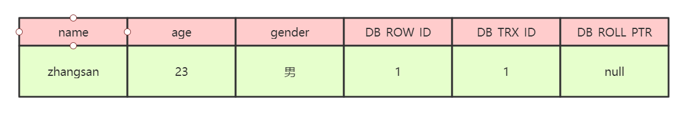
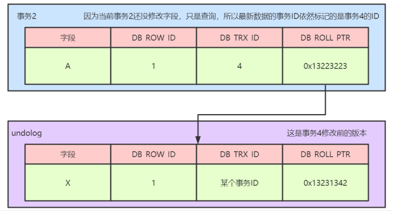
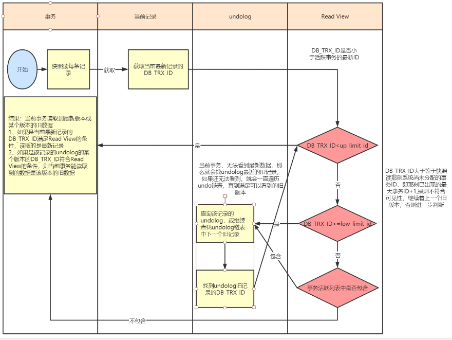

#### MVCC实现原理是什么？

		mvcc的实现原理主要依赖于记录中的三个隐藏字段，undolog，read view来实现的。
	
		**隐藏字段**
	
		每行记录除了我们自定义的字段外，还有数据库隐式定义的DB_TRX_ID,DB_ROLL_PTR,DB_ROW_ID等字段
	
		DB_TRX_ID
	
		6字节，最近修改事务id，记录创建这条记录或者最后一次修改该记录的事务id
	
		DB_ROLL_PTR
	
		7字节，回滚指针，指向这条记录的上一个版本,用于配合undolog，指向上一个旧版本
	
		DB_ROW_JD
	
		6字节，隐藏的主键，如果数据表没有主键，那么innodb会自动生成一个6字节的row_id
	
		记录如图所示：

		在上图中，DB_ROW_ID是数据库默认为该行记录生成的唯一隐式主键，DB_TRX_ID是当前操作该记录的事务ID，DB_ROLL_PTR是一个回滚指针，用于配合undo日志，指向上一个旧版本
	
		**undo log**
	
		undolog被称之为回滚日志，表示在进行insert，delete，update操作的时候产生的方便回滚的日志
	
		当进行insert操作的时候，产生的undolog只在事务回滚的时候需要，并且在事务提交之后可以被立刻丢弃
	
		当进行update和delete操作的时候，产生的undolog不仅仅在事务回滚的时候需要，在快照读的时候也需要，所以不能随便删除，只有在快照读或事务回滚不涉及该日志时，对应的日志才会被purge线程统一清除（当数据发生更新和删除操作的时候都只是设置一下老记录的deleted_bit，并不是真正的将过时的记录删除，因为为了节省磁盘空间，innodb有专门的purge线程来清除deleted_bit为true的记录，如果某个记录的deleted_id为true，并且DB_TRX_ID相对于purge线程的read view 可见，那么这条记录一定时可以被清除的）
	
		**下面我们来看一下undolog生成的记录链**
	
		1、假设有一个事务编号为1的事务向表中插入一条记录，那么此时行数据的状态为：

		2、假设有第二个事务编号为2对该记录的name做出修改，改为lisi
	
		在事务2修改该行记录数据时，数据库会对该行加排他锁
	
		然后把该行数据拷贝到undolog中，作为 旧记录，即在undolog中有当前行的拷贝副本
	
		拷贝完毕后，修改该行name为lisi，并且修改隐藏字段的事务id为当前事务2的id，回滚指针指向拷贝到undolog的副本记录中
	
		事务提交后，释放锁

		3、假设有第三个事务编号为3对该记录的age做了修改，改为32
	
		在事务3修改该行数据的时，数据库会对该行加排他锁
	
		然后把该行数据拷贝到undolog中，作为旧纪录，发现该行记录已经有undolog了，那么最新的旧数据作为链表的表头，插在该行记录的undolog最前面
	
		修改该行age为32岁，并且修改隐藏字段的事务id为当前事务3的id，回滚指针指向刚刚拷贝的undolog的副本记录
	
		事务提交，释放锁

		从上述的一系列图中，大家可以发现，不同事务或者相同事务的对同一记录的修改，会导致该记录的undolog生成一条记录版本线性表，即链表，undolog的链首就是最新的旧记录，链尾就是最早的旧记录。
	
		**Read View**
	
		上面的流程如果看明白了，那么大家需要再深入理解下read view的概念了。
	
		Read View是事务进行快照读操作的时候生产的读视图，在该事务执行快照读的那一刻，会生成一个数据系统当前的快照，记录并维护系统当前活跃事务的id，事务的id值是递增的。
	
		其实Read View的最大作用是用来做可见性判断的，也就是说当某个事务在执行快照读的时候，对该记录创建一个Read View的视图，把它当作条件去判断当前事务能够看到哪个版本的数据，有可能读取到的是最新的数据，也有可能读取的是当前行记录的undolog中某个版本的数据
	
		Read View遵循的可见性算法主要是将要被修改的数据的最新记录中的DB_TRX_ID（当前事务id）取出来，与系统当前其他活跃事务的id去对比，如果DB_TRX_ID跟Read View的属性做了比较，不符合可见性，那么就通过DB_ROLL_PTR回滚指针去取出undolog中的DB_TRX_ID做比较，即遍历链表中的DB_TRX_ID，直到找到满足条件的DB_TRX_ID,这个DB_TRX_ID所在的旧记录就是当前事务能看到的最新老版本数据。
	
		Read View的可见性规则如下所示：
	
		首先要知道Read View中的三个全局属性：
	
		trx_list:一个数值列表，用来维护Read View生成时刻系统正活跃的事务ID（1,2,3）
	
		up_limit_id:记录trx_list列表中事务ID最小的ID（1）
	
		low_limit_id:Read View生成时刻系统尚未分配的下一个事务ID，（4）
	
		具体的比较规则如下：
	
		1、首先比较DB_TRX_ID < up_limit_id,如果小于，则当前事务能看到DB_TRX_ID所在的记录，如果大于等于进入下一个判断
	
		2、接下来判断DB_TRX_ID >= low_limit_id,如果大于等于则代表DB_TRX_ID所在的记录在Read View生成后才出现的，那么对于当前事务肯定不可见，如果小于，则进入下一步判断
	
		3、判断DB_TRX_ID是否在活跃事务中，如果在，则代表在Read View生成时刻，这个事务还是活跃状态，还没有commit，修改的数据，当前事务也是看不到，如果不在，则说明这个事务在Read View生成之前就已经开始commit，那么修改的结果是能够看见的。

7、MVCC的整体处理流程

假设有四个事务同时在执行，如下图所示：

| 事务1    | 事务2    | 事务3    | 事务4        |
| -------- | -------- | -------- | ------------ |
| 事务开始 | 事务开始 | 事务开始 | 事务开始     |
| ......   | ......   | ......   | 修改且已提交 |
| 进行中   | 快照读   | 进行中   |              |
| ......   | ......   | ......   |              |

从上述表格中，我们可以看到，当事务2对某行数据执行了快照读，数据库为该行数据生成一个Read View视图，可以看到事务1和事务3还在活跃状态，事务4在事务2快照读的前一刻提交了更新，所以，在Read View中记录了系统当前活跃事务1，3，维护在一个列表中。同时可以看到up_limit_id的值为1，而low_limit_id为5，如下图所示：

在上述的例子中，只有事务4修改过该行记录，并在事务2进行快照读前，就提交了事务，所以该行当前数据的undolog如下所示：

		当事务2在快照读该行记录的是，会拿着该行记录的DB_TRX_ID去跟up_limit_id,lower_limit_id和活跃事务列表进行比较，判读事务2能看到该行记录的版本是哪个。
	
		具体流程如下：先拿该行记录的事务ID（4）去跟Read View中的up_limit_id相比较，判断是否小于，通过对比发现不小于，所以不符合条件，继续判断4是否大于等于low_limit_id,通过比较发现也不大于，所以不符合条件，判断事务4是否处理trx_list列表中，发现不再次列表中，那么符合可见性条件，所以事务4修改后提交的最新结果对事务2 的快照是可见的，因此，事务2读取到的最新数据记录是事务4所提交的版本，而事务4提交的版本也是全局角度的最新版本。如下图所示：

当上述的内容都看明白了的话，那么大家就应该能够搞清楚这几个核心概念之间的关系了，下面我们讲一个不同的隔离级别下的快照读的不同。

8、RC、RR级别下的InnoDB快照读有什么不同

		因为Read View生成时机的不同，从而造成RC、RR级别下快照读的结果的不同
	
		1、在RR级别下的某个事务的对某条记录的第一次快照读会创建一个快照即Read View,将当前系统活跃的其他事务记录起来，此后在调用快照读的时候，还是使用的是同一个Read View,所以只要当前事务在其他事务提交更新之前使用过快照读，那么之后的快照读使用的都是同一个Read View,所以对之后的修改不可见
	
		2、在RR级别下，快照读生成Read View时，Read View会记录此时所有其他活动和事务的快照，这些事务的修改对于当前事务都是不可见的，而早于Read View创建的事务所做的修改均是可见
	
		3、在RC级别下，事务中，每次快照读都会新生成一个快照和Read View,这就是我们在RC级别下的事务中可以看到别的事务提交的更新的原因。
	
		**总结：在RC隔离级别下，是每个快照读都会生成并获取最新的Read View,而在RR隔离级别下，则是同一个事务中的第一个快照读才会创建Read View，之后的快照读获取的都是同一个Read View.**