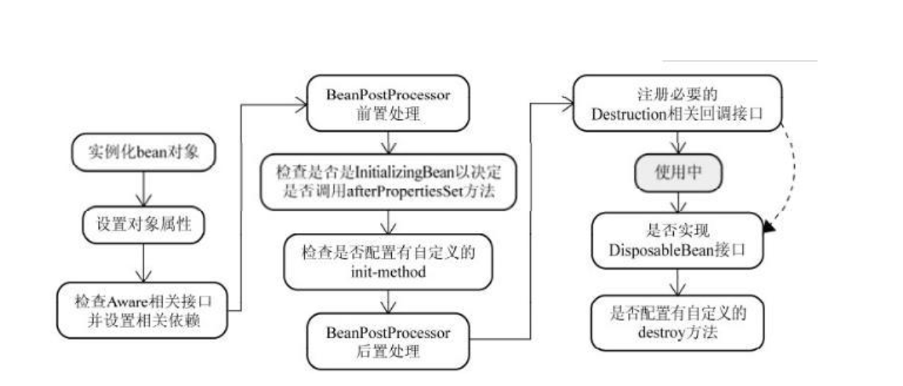
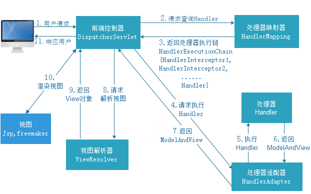

# 说说你对Spring 的理解？

官网地址：https://spring.io/projects/spring-framework#overview

压缩包下载地址：https://repo.spring.io/release/org/springframework/spring/

源码地址：https://github.com/spring-projects/spring-framework

```tex
Spring makes it easy to create Java enterprise applications. It provides everything you need to embrace the Java language in an enterprise environment, with support for Groovy and Kotlin as alternative languages on the JVM, and with the flexibility to create many kinds of architectures depending on an application’s needs. As of Spring Framework 5.1, Spring requires JDK 8+ (Java SE 8+) and provides out-of-the-box support for JDK 11 LTS. Java SE 8 update 60 is suggested as the minimum patch release for Java 8, but it is generally recommended to use a recent patch release.

Spring supports a wide range of application scenarios. In a large enterprise, applications often exist for a long time and have to run on a JDK and application server whose upgrade cycle is beyond developer control. Others may run as a single jar with the server embedded, possibly in a cloud environment. Yet others may be standalone applications (such as batch or integration workloads) that do not need a server.

Spring is open source. It has a large and active community that provides continuous feedback based on a diverse range of real-world use cases. This has helped Spring to successfully evolve over a very long time.

Spring 使创建 Java 企业应用程序变得更加容易。它提供了在企业环境中接受 Java 语言所需的一切,，并支持 Groovy 和 Kotlin 作为 JVM 上的替代语言，并可根据应用程序的需要灵活地创建多种体系结构。 从 Spring Framework 5.0 开始，Spring 需要 JDK 8(Java SE 8+)，并且已经为 JDK 9 提供了现成的支持。

Spring支持各种应用场景， 在大型企业中, 应用程序通常需要运行很长时间，而且必须运行在 jdk 和应用服务器上，这种场景开发人员无法控制其升级周期。 其他可能作为一个单独的jar嵌入到服务器去运行，也有可能在云环境中。还有一些可能是不需要服务器的独立应用程序(如批处理或集成的工作任务)。

Spring 是开源的。它拥有一个庞大而且活跃的社区，提供不同范围的，真实用户的持续反馈。这也帮助Spring不断地改进,不断发展。
```

# 你觉得Spring的核心是什么？

		spring是一个开源框架。
	
		spring是为了简化企业开发而生的，使得开发变得更加优雅和简洁。
	
		spring是一个**IOC**和**AOP**的容器框架。
	
				IOC：控制反转
	
				AOP：面向切面编程
	
				容器：包含并管理应用对象的生命周期，就好比用桶装水一样，spring就是桶，而对象就是水

# 说一下使用spring的优势？

		1、Spring通过DI、AOP和消除样板式代码来简化企业级Java开发
	
		2、Spring框架之外还存在一个构建在核心框架之上的庞大生态圈，它将Spring扩展到不同的领域，如Web服务、REST、移动开发以及NoSQL
	
		3、低侵入式设计，代码的污染极低
	
		4、独立于各种应用服务器，基于Spring框架的应用，可以真正实现Write Once,Run Anywhere的承诺
	
		5、Spring的IoC容器降低了业务对象替换的复杂性，提高了组件之间的解耦
	
		6、Spring的AOP支持允许将一些通用任务如安全、事务、日志等进行集中式处理，从而提供了更好的复用
	
		7、Spring的ORM和DAO提供了与第三方持久层框架的的良好整合，并简化了底层的数据库访问
	
		8、Spring的高度开放性，并不强制应用完全依赖于Spring，开发者可自由选用Spring框架的部分或全部

# 简述spring bean的生命周期？



1、实例化bean对象

	通过反射的方式进行对象的创建，此时的创建只是在堆空间中申请空间，属性都是默认值

2、设置对象属性

	给对象中的属性进行值的设置工作

3、检查Aware相关接口并设置相关依赖

	如果对象中需要引用容器内部的对象，那么需要调用aware接口的子类方法来进行统一的设置

4、BeanPostProcessor的前置处理

	对生成的bean对象进行前置的处理工作

5、检查是否是InitializingBean的子类来决定是否调用afterPropertiesSet方法

	判断当前bean对象是否设置了InitializingBean接口，然后进行属性的设置等基本工作

6、检查是否配置有自定义的init-method方法

	如果当前bean对象定义了初始化方法，那么在此处调用初始化方法

7、BeanPostProcessor后置处理

	对生成的bean对象进行后置的处理工作

8、注册必要的Destruction相关回调接口

	为了方便对象的销毁，在此处调用注销的回调接口，方便对象进行销毁操作

9、获取并使用bean对象

	通过容器来获取对象并进行使用

10、是否实现DisposableBean接口

	判断是否实现了DisposableBean接口，并调用具体的方法来进行对象的销毁工作

11、是否配置有自定义的destory方法

	如果当前bean对象定义了销毁方法，那么在此处调用销毁方法

# spring支持的bean作用域有哪些？

① singleton

使用该属性定义Bean时，IOC容器仅创建一个Bean实例，IOC容器每次返回的是同一个Bean实例。

② prototype

使用该属性定义Bean时，IOC容器可以创建多个Bean实例，每次返回的都是一个新的实例。

③ request

该属性仅对HTTP请求产生作用，使用该属性定义Bean时，每次HTTP请求都会创建一个新的Bean，适用于WebApplicationContext环境。

④ session

该属性仅用于HTTP Session，同一个Session共享一个Bean实例。不同Session使用不同的实例。

⑤ global-session

该属性仅用于HTTP Session，同session作用域不同的是，所有的Session共享一个Bean实例。

# Spring框架中的单例Bean是线程安全的么？

		Spring中的Bean对象默认是单例的，框架并没有对bean进行多线程的封装处理
	
		如果Bean是有状态的，那么就需要开发人员自己来保证线程安全的保证，最简单的办法就是改变bean的作用域把singleton改成prototype，这样每次请求bean对象就相当于是创建新的对象来保证线程的安全
	
		有状态就是由数据存储的功能
	
		无状态就是不会存储数据，你想一下，我们的controller，service和dao本身并不是线程安全的，只是调用里面的方法，而且多线程调用一个实例的方法，会在内存中复制遍历，这是自己线程的工作内存，是最安全的。
	
		因此在进行使用的时候，不要在bean中声明任何有状态的实例变量或者类变量，如果必须如此，也推荐大家使用ThreadLocal把变量变成线程私有，如果bean的实例变量或者类变量需要在多个线程之间共享，那么就只能使用synchronized，lock，cas等这些实现线程同步的方法了。

# spring框架中使用了哪些设计模式及应用场景

		1.工厂模式，在各种BeanFactory以及ApplicationContext创建中都用到了
	
		2.模版模式，在各种BeanFactory以及ApplicationContext实现中也都用到了
	
		3.代理模式，Spring AOP 利用了 AspectJ AOP实现的! AspectJ AOP 的底层用了动态代理
	
		4.策略模式，加载资源文件的方式，使用了不同的方法，比如：ClassPathResourece，FileSystemResource，ServletContextResource，UrlResource但他们都有共同的借口Resource；在Aop的实现中，采用了两种不同的方式，JDK动态代理和CGLIB代理
	
		5.单例模式，比如在创建bean的时候。
	
		6.观察者模式，spring中的ApplicationEvent，ApplicationListener,ApplicationEventPublisher
	
		7.适配器模式，MethodBeforeAdviceAdapter,ThrowsAdviceAdapter,AfterReturningAdapter
	
		8.装饰者模式，源码中类型带Wrapper或者Decorator的都是

# 什么的是bean的自动装配，它有哪些方式？

		bean的自动装配指的是bean的属性值在进行注入的时候通过某种特定的规则和方式去容器中查找，并设置到具体的对象属性中，主要有五种方式：
	
		no – 缺省情况下，自动配置是通过“ref”属性手动设定，在项目中最常用
		byName – 根据属性名称自动装配。如果一个bean的名称和其他bean属性的名称是一样的，将会自装配它。
		byType – 按数据类型自动装配，如果bean的数据类型是用其它bean属性的数据类型，兼容并自动装配它。
		constructor – 在构造函数参数的byType方式。
		autodetect – 如果找到默认的构造函数，使用“自动装配用构造”; 否则，使用“按类型自动装配”。

# spring、springmvc、springboot的区别是什么？

	spring和springMvc：

1. spring是一个一站式的轻量级的java开发框架，核心是控制反转（IOC）和面向切面（AOP），针对于开发的WEB层(springMvc)、业务层(Ioc)、持久层(jdbcTemplate)等都提供了多种配置解决方案；

2. springMvc是spring基础之上的一个MVC框架，主要处理web开发的路径映射和视图渲染，属于spring框架中WEB层开发的一部分；

  springMvc和springBoot：

  1、springMvc属于一个企业WEB开发的MVC框架，涵盖面包括前端视图开发、文件配置、后台接口逻辑开发等，XML、config等配置相对比较繁琐复杂；

  2、springBoot框架相对于springMvc框架来说，更专注于开发微服务后台接口，不开发前端视图，同时遵循默认优于配置，简化了插件配置流程，不需要配置xml，相对springmvc，大大简化了配置流程；

  总结：

  1、Spring 框架就像一个家族，有众多衍生产品例如 boot、security、jpa等等。但他们的基础都是Spring的ioc、aop等. ioc 提供了依赖注入的容器， aop解决了面向横切面编程，然后在此两者的基础上实现了其他延伸产品的高级功能；

  2、springMvc主要解决WEB开发的问题，是基于Servlet 的一个MVC框架，通过XML配置，统一开发前端视图和后端逻辑；

  3、由于Spring的配置非常复杂，各种XML、JavaConfig、servlet处理起来比较繁琐，为了简化开发者的使用，从而创造性地推出了springBoot框架，默认优于配置，简化了springMvc的配置流程；但区别于springMvc的是，springBoot专注于单体微服务接口开发，和前端解耦，虽然springBoot也可以做成springMvc前后台一起开发，但是这就有点不符合springBoot框架的初衷了；

# springmvc工作流程是什么？

		当发起请求时被前置的控制器拦截到请求，根据请求参数生成代理请求，找到请求对应的实际控制器，控制器处理请求，创建数据模型，访问数据库，将模型响应给中心控制器，控制器使用模型与视图渲染视图结果，将结果返回给中心控制器，再将结果返回给请求者。



1、DispatcherServlet表示前置控制器，是整个SpringMVC的控制中心。用户发出请求，DispatcherServlet接收请求并拦截请求。
2、HandlerMapping为处理器映射。DispatcherServlet调用HandlerMapping,HandlerMapping根据请求url查找Handler。
3、返回处理器执行链，根据url查找控制器，并且将解析后的信息传递给DispatcherServlet
4、HandlerAdapter表示处理器适配器，其按照特定的规则去执行Handler。
5、执行handler找到具体的处理器
6、Controller将具体的执行信息返回给HandlerAdapter,如ModelAndView。
7、HandlerAdapter将视图逻辑名或模型传递给DispatcherServlet。
8、DispatcherServlet调用视图解析器(ViewResolver)来解析HandlerAdapter传递的逻辑视图名。
9、视图解析器将解析的逻辑视图名传给DispatcherServlet。
10、DispatcherServlet根据视图解析器解析的视图结果，调用具体的视图，进行试图渲染
11、将响应数据返回给客户端


# 如何理解springboot中的starter？

		使用spring+springmvc框架进行开发的时候，如果需要引入mybatis框架，那么需要在xml中定义需要的bean对象，这个过程很明显是很麻烦的，如果需要引入额外的其他组件，那么也需要进行复杂的配置，因此在springboot中引入了starter
	
		starter就是一个jar包，写一个@Configuration的配置类，将这些bean定义在其中，然后再starter包的META-INF/spring.factories中写入配置类，那么springboot程序在启动的时候就会按照约定来加载该配置类
	
		开发人员只需要将相应的starter包依赖进应用中，进行相关的属性配置，就可以进行代码开发，而不需要单独进行bean对象的配置