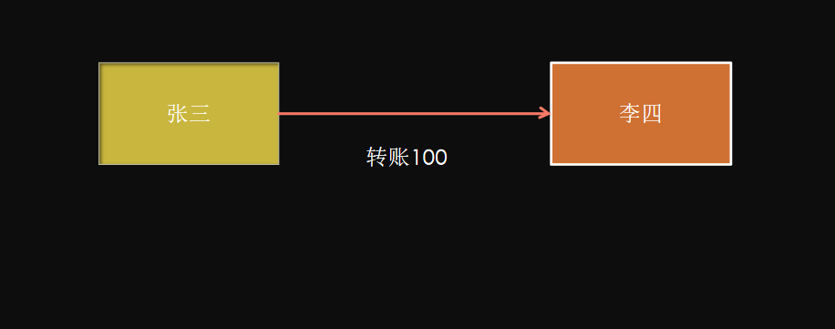

# 什么是嵌入式服务器，为什么使用嵌入式服务器？

​		在springboot框架中，大家应该发现了有一个内嵌的tomcat，在之前的开发流程中，每次写好代码之后必须要将项目部署到一个额外的web服务器中，只有这样才可以运行，这个明显要麻烦很多，而使用springboot的时候，你会发现在启动项目的时候可以直接按照java应用程序的方式来启动项目，不需要额外的环境支持，也不需要tomcat服务器，这是因为在springboot框架中内置了tomcat.jar，来通过main方法启动容器，达到一键开发部署的方式，不需要额外的任何其他操作。


+ # TCC解决方案是什么?

  ​		TCC（Try-Confirm-Cancel）是一种常用的分布式事务解决方案，它将一个事务拆分成三个步骤：

  + T（Try）：业务检查阶段，这阶段主要进行业务校验和检查或者资源预留；也可能是直接进行业务操作。

  + C（Confirm）：业务确认阶段，这阶段对Try阶段校验过的业务或者预留的资源进行确认。

  + C（Cancel）：业务回滚阶段，这阶段和上面的C（Confirm）是互斥的，用于释放Try阶段预留的资源或者业务。

  

  

  

  

  

  

  

  

# TCC空回滚是解决什么问题的？

​        在没有调用TCC资源Try方法的情况下，调用了二阶段的Cancel方法。比如当Try请求由于网络延迟或故障等原因，没有执行，结果返回了异常，那么此时Cancel就不能正常执行，因为Try没有对数据进行修改，如果Cancel进行了对数据的修改，那就会导致数据不一致。
​		解决思路是关键就是要识别出这个空回滚。思路很简单就是需要知道Try阶段是否执行，如果执行了，那就是正常回滚；如果没执行，那就是空回滚。建议TM在发起全局事务时生成全局事务记录，全局事务ID贯穿整个分布式事务调用链条。再额外增加一张**分支事务记录表**，其中有全局事务ID和分支事务ID，第一阶段Try方法里会插入一条记录，表示Try阶段执行了。Cancel接口里读取该记录，如果该记录存在，则正常回滚；如果该记录不存在，则是空回滚。

# 如何解决TCC幂等问题？

为了保证TCC二阶段提交重试机制不会引发数据不一致，要求TCC的二阶段Confirm和Cancel接口保证幂等，这样不会重复使用或者释放资源。如果幂等控制没有做好，很有可能导致数据不一致等严重问题。
解决思路在上述 **分支事务记录**中增加执行状态，每次执行前都查询该状态。


分布式锁。

# 如何解决TCC中悬挂问题？

悬挂就是对于一个分布式事务，其二阶段Cancel接口比Try接口先执行。
		出现原因是在调用分支事务Try时，由于网络发生拥堵，造成了超时，TM就会通知RM回滚该分布式事务，可能回滚完成后，Try请求才到达参与者真正执行，而一个Try方法预留的业务资源，只有该分布式事务才能使用，该分布式事务第一阶段预留的业务资源就再也没有人能够处理了，对于这种情况，我们就称为悬挂，即业务资源预留后无法继续处理。
		解决思路是如果二阶段执行完成，那一阶段就不能再继续执行。在执行一阶段事务时判断在该全局事务下，判断**分支事务记录表**中是否已经有二阶段事务记录，如果有则不执行Try。


# 可靠消息服务方案是什么？

​		可靠消息最终一致性方案指的是：当事务的发起方（事务参与者，消息发送者）执行完本地事务后，同时发出一条消息，事务参与方（事务参与者，消息的消费者）一定能够接受消息并可以成功处理自己的事务。

​		这里面强调两点：

1. 可靠消息：发起方一定得把消息传递到消费者。
2. 最终一致性：最终发起方的业务处理和消费方的业务处理得完成，达成最终一致。


# 最大努力通知方案的关键是什么？

1.  有一定的消息重复通知机制。因为接收通知方（上图中的我方支付系统）可能没有接收到通知，此时要有一定的机制对消息重复通知。
2.  消息校对机制。如果尽最大努力也没有通知到接收方，或者接收方消费消息后要再次消费，此时可由接收方主动向通知方查询消息信息来满足需求。

# 什么是分布式系统中的幂等？

幂等（idempotent、idempotence）是一个数学与计算机学概念，常见于抽象代数中。

在编程中，一个幂等操作的特点是其任意多次执行所产生的影响均与一次执行的影响相同。幂等函数，或幂等方法，是指可以使用相同参数重复执行，并能获得相同结果的函数。这些函数不会影响系统状态，也不用担心重复执行会对系统造成改变。

例如，“getUsername()和 setTrue()”函数就是一个幂等函数. 更复杂的操作幂等保证是利用唯一交易号(流水号)实现. 我的理解：幂等就是一个操作，不论执行多少次，产生的效果和返回的结果都是一样的。


操作：查询，set固定值。逻辑删除。set 固定值。

流程：分布式系统中，网络调用，重试机制。


# 双写一致性问题如何解决？

先做一个说明，从理论上来说，给缓存设置过期时间，是保证最终一致性的解决方案。这种方案下，我们可以对存入缓存的数据设置过期时间，所有的写操作以数据库为准，对缓存操作只是尽最大努力更新即可。也就是说如果数据库写成功，缓存更新失败，那么只要到达过期时间，则后面的读请求自然会从数据库中读取新值然后回填缓存。因此，接下来讨论的思路不依赖于给缓存设置过期时间这个方案。
在这里，我们讨论**三种**更新策略：

1. 先更新缓存，再更新数据库。（不可取）
2. 先更新数据库，再更新缓存。（不可取）
3. 先删除缓存，再更新数据库。（不可取）
4. 先更新数据库，再删除缓存。（可取，有问题待解决）

### 大前提：

先读缓存，如果缓存没有，才从数据库读取。

### (1)先更新数据库，再更新缓存

这套方案，大家是普遍反对的。为什么呢？有如下两点原因。
**原因一（线程安全角度）**
同时有请求A和请求B进行更新操作，那么会出现
（1）线程A更新了数据库
（2）线程B更新了数据库
（3）线程B更新了缓存
（4）线程A更新了缓存
这就出现请求A更新缓存应该比请求B更新缓存早才对，但是因为网络等原因，B却比A更早更新了缓存。这就导致了脏数据，因此不考虑。
**原因二（业务场景角度）**
有如下两点：
（1）如果你是一个写数据库场景比较多，而读数据场景比较少的业务需求，采用这种方案就会导致，数据压根还没读到，缓存就被频繁的更新，浪费性能。
（2）如果你写入数据库的值，并不是直接写入缓存的，而是要经过一系列复杂的计算再写入缓存。那么，每次写入数据库后，都再次计算写入缓存的值，无疑是浪费性能的。显然，删除缓存更为适合。

接下来讨论的就是争议最大的，先删缓存，再更新数据库。还是先更新数据库，再删缓存的问题。

### (2)先删缓存，再更新数据库

该方案会导致不一致的原因是。同时有一个请求A进行更新操作，另一个请求B进行查询操作。那么会出现如下情形:
（1）请求A进行写操作，删除缓存
（2）请求B查询发现缓存不存在
（3）请求B去数据库查询得到旧值
（4）请求B将旧值写入缓存
（5）请求A将新值写入数据库
上述情况就会导致不一致的情形出现。而且，如果不采用给缓存设置过期时间策略，该数据永远都是脏数据。
那么，**如何解决呢？采用延时双删策略**

（1）先淘汰缓存
（2）再写数据库（这两步和原来一样）
（3）休眠1秒，再次淘汰缓存
这么做，可以将1秒内所造成的缓存脏数据，再次删除。
**那么，这个1秒怎么确定的，具体该休眠多久呢？**
针对上面的情形，读者应该自行评估自己的项目的读数据业务逻辑的耗时。然后写数据的休眠时间则在读数据业务逻辑的耗时基础上，加几百ms即可。这么做的目的，就是确保读请求结束，写请求可以删除读请求造成的缓存脏数据。
**如果你用了mysql的读写分离架构怎么办？**
ok，在这种情况下，造成数据不一致的原因如下，还是两个请求，一个请求A进行更新操作，另一个请求B进行查询操作。
（1）请求A进行写操作，删除缓存
（2）请求A将数据写入数据库了，
（3）请求B查询缓存发现，缓存没有值
（4）请求B去从库查询，这时，还没有完成主从同步，因此查询到的是旧值
（5）请求B将旧值写入缓存
（6）数据库完成主从同步，从库变为新值
上述情形，就是数据不一致的原因。还是使用双删延时策略。只是，睡眠时间修改为在主从同步的延时时间基础上，加几百ms。
**采用这种同步淘汰策略，吞吐量降低怎么办？**
ok，那就将第二次删除作为异步的。自己起一个线程，异步删除。这样，写的请求就不用沉睡一段时间后了，再返回。这么做，加大吞吐量。
**第二次删除,如果删除失败怎么办？**
这是个非常好的问题，因为第二次删除失败，就会出现如下情形。还是有两个请求，一个请求A进行更新操作，另一个请求B进行查询操作，为了方便，假设是单库：
（1）请求A进行写操作，删除缓存
（2）请求B查询发现缓存不存在
（3）请求B去数据库查询得到旧值
（4）请求B将旧值写入缓存
（5）请求A将新值写入数据库
（6）请求A试图去删除，请求B写入对的缓存值，结果失败了。
ok,这也就是说。如果第二次删除缓存失败，会再次出现缓存和数据库不一致的问题。
**如何解决呢？**

### (3)先更新数据库，再删缓存

首先，先说一下。老外提出了一个缓存更新套路，名为[《Cache-Aside pattern》](https://docs.microsoft.com/en-us/azure/architecture/patterns/cache-aside)。其中就指出

- **失效**：应用程序先从cache取数据，没有得到，则从数据库中取数据，成功后，放到缓存中。
- **命中**：应用程序从cache中取数据，取到后返回。
- **更新**：先把数据存到数据库中，成功后，再让缓存失效。

另外，知名社交网站facebook也在论文[《Scaling Memcache at Facebook》](https://www.usenix.org/system/files/conference/nsdi13/nsdi13-final170_update.pdf)中提出，他们用的也是先更新数据库，再删缓存的策略。
**这种情况不存在并发问题么？**
不是的。假设这会有两个请求，一个请求A做查询操作，一个请求B做更新操作，那么会有如下情形产生
（1）缓存刚好失效
（2）请求A查询数据库，得一个旧值
（3）请求B将新值写入数据库
（4）请求B删除缓存
（5）请求A将查到的旧值写入缓存
ok，如果发生上述情况，确实是会发生脏数据。
**然而，发生这种情况的概率又有多少呢？**
发生上述情况有一个先天性条件，就是步骤（3）的写数据库操作比步骤（2）的读数据库操作耗时更短，才有可能使得步骤（4）先于步骤（5）。可是，大家想想，数据库的读操作的速度远快于写操作的（不然做读写分离干嘛，做读写分离的意义就是因为读操作比较快，耗资源少），因此步骤（3）耗时比步骤（2）更短，这一情形很难出现。
假设，有人非要抬杠，有强迫症，一定要解决怎么办？
**如何解决上述并发问题？**
首先，给缓存设有效时间是一种方案。其次，采用策略（2）里给出的异步延时删除策略，保证读请求完成以后，再进行删除操作。
**还有其他造成不一致的原因么？**
有的，这也是缓存更新策略（2）和缓存更新策略（3）都存在的一个问题，如果删缓存失败了怎么办，那不是会有不一致的情况出现么。比如一个写数据请求，然后写入数据库了，删缓存失败了，这会就出现不一致的情况了。这也是缓存更新策略（2）里留下的最后一个疑问。
**如何解决？**
提供一个保障的重试机制即可，这里给出两套方案。
**方案一**：
如下图所示

流程如下所示
（1）更新数据库数据；
（2）缓存因为种种问题删除失败
（3）将需要删除的key发送至消息队列
（4）自己消费消息，获得需要删除的key
（5）继续重试删除操作，直到成功
然而，该方案有一个缺点，对业务线代码造成大量的侵入。于是有了方案二，在方案二中，启动一个订阅程序去订阅数据库的binlog，获得需要操作的数据。在应用程序中，另起一段程序，获得这个订阅程序传来的信息，进行删除缓存操作。
**方案二**：

流程如下图所示：
（1）更新数据库数据
（2）数据库会将操作信息写入binlog日志当中
（3）订阅程序提取出所需要的数据以及key
（4）另起一段非业务代码，获得该信息
（5）尝试删除缓存操作，发现删除失败
（6）将这些信息发送至消息队列
（7）重新从消息队列中获得该数据，重试操作。

**备注说明：**上述的订阅binlog程序在mysql中有现成的中间件叫canal，可以完成订阅binlog日志的功能。至于oracle中，博主目前不知道有没有现成中间件可以使用。另外，重试机制，博主是采用的是消息队列的方式。如果对一致性要求不是很高，直接在程序中另起一个线程，每隔一段时间去重试即可，这些大家可以灵活自由发挥，只是提供一个思路。


# 分布式微服务项目你是如何设计的？

我一般设计成两层：业务层和能力层（中台），业务层接受用户请求，然后通过调用能力层来完成业务逻辑。


# 认证 (Authentication) 和授权 (Authorization)的区别是什么？

Authentication（认证） 是验证您的身份的凭据（例如用户名/用户ID和密码），通过这个凭据，系统得以知道你就是你，也就是说系统存在你这个用户。所以，Authentication 被称为身份/用户验证。
Authorization（授权） 发生在 Authentication（认证） 之后。授权，它主要掌管我们访问系统的权限。比如有些特定资源只能具有特定权限的人才能访问比如admin，有些对系统资源操作比如删除、添加、更新只能特定人才具有。
这两个一般在我们的系统中被结合在一起使用，目的就是为了保护我们系统的安全性。


# 为什么Cookie 无法防止CSRF攻击，而token可以？

**CSRF（Cross Site Request Forgery）**一般被翻译为 跨站请求伪造 。那么什么是 跨站请求伪造 呢？说简单用你的身份去发送一些对你不友好的请求。举个简单的例子：

小壮登录了某网上银行，他来到了网上银行的帖子区，看到一个帖子下面有一个链接写着“科学理财，年盈利率过万”，小壮好奇的点开了这个链接，结果发现自己的账户少了10000元。这是这么回事呢？原来黑客在链接中藏了一个请求，这个请求直接利用小壮的身份给银行发送了一个转账请求,也就是通过你的 Cookie 向银行发出请求。

<a src=http://www.mybank.com/Transfer?bankId=11&money=10000>科学理财，年盈利率过万</>
进行Session 认证的时候，我们一般使用 Cookie 来存储 SessionId,当我们登陆后后端生成一个SessionId放在Cookie中返回给客户端，服务端通过Redis或者其他存储工具记录保存着这个Sessionid，客户端登录以后每次请求都会带上这个SessionId，服务端通过这个SessionId来标示你这个人。如果别人通过 cookie拿到了 SessionId 后就可以代替你的身份访问系统了。

Session 认证中 Cookie 中的 SessionId是由浏览器发送到服务端的，借助这个特性，攻击者就可以通过让用户误点攻击链接，达到攻击效果。

但是，我们使用 token 的话就不会存在这个问题，在我们登录成功获得 token 之后，一般会选择存放在 local storage 中。然后我们在前端通过某些方式会给每个发到后端的请求加上这个 token,这样就不会出现 CSRF 漏洞的问题。因为，即使有个你点击了非法链接发送了请求到服务端，这个非法请求是不会携带 token 的，所以这个请求将是非法的。


# 什么是 Token?什么是 JWT?如何基于Token进行身份验证？

我们知道 Session 信息需要保存一份在服务器端。这种方式会带来一些麻烦，比如需要我们保证保存 Session 信息服务器的可用性、不适合移动端（依赖Cookie）等等。

有没有一种不需要自己存放 Session 信息就能实现身份验证的方式呢？使用 Token 即可！JWT （JSON Web Token） 就是这种方式的实现，通过这种方式服务器端就不需要保存 Session 数据了，只用在客户端保存服务端返回给客户的 Token 就可以了，扩展性得到提升。

JWT 本质上就一段签名的 JSON 格式的数据。由于它是带有签名的，因此接收者便可以验证它的真实性。

下面是 RFC 7519 对 JWT 做的较为正式的定义。

JSON Web Token (JWT) is a compact, URL-safe means of representing claims to be transferred between two parties. The claims in a JWT are encoded as a JSON object that is used as the payload of a JSON Web Signature (JWS) structure or as the plaintext of a JSON Web Encryption (JWE) structure, enabling the claims to be digitally signed or integrity protected with a Message Authentication Code (MAC) and/or encrypted. ——JSON Web Token (JWT)

JWT 由 3 部分构成:

Header :描述 JWT 的元数据。定义了生成签名的算法以及 Token 的类型。
Payload（负载）:用来存放实际需要传递的数据
Signature（签名）：服务器通过Payload、Header和一个密钥(secret)使用 Header 里面指定的签名算法（默认是 HMAC SHA256）生成。
在基于 Token 进行身份验证的的应用程序中，服务器通过Payload、Header和一个密钥(secret)创建令牌（Token）并将 Token 发送给客户端，客户端将 Token 保存在 Cookie 或者 localStorage 里面，以后客户端发出的所有请求都会携带这个令牌。你可以把它放在 Cookie 里面自动发送，但是这样不能跨域，所以更好的做法是放在 HTTP Header 的 Authorization字段中：Authorization: Bearer Token。


用户向服务器发送用户名和密码用于登陆系统。
身份验证服务响应并返回了签名的 JWT，上面包含了用户是谁的内容。
用户以后每次向后端发请求都在Header中带上 JWT。
服务端检查 JWT 并从中获取用户相关信息。


# 分布式架构下，Session 共享有什么方案?

1. 不要有session：但是确实在某些场景下，是可以没有session的，其实在很多接口类系统当中，都提倡【API无状态服务】；也就是每一次的接口访问，都不依赖于session、不依赖于前一次的接口访问；
2. 存入cookie中：将session存储到cookie中，但是缺点也很明显，例如每次请求都得带着session，数据存储在客户端本地，是有风险的；
3. session同步：对个服务器之间同步session，这样可以保证每个服务器上都有全部的session信息，不过当服务器数量比较多的时候，同步是会有延迟甚至同步失败；
4. 使用Nginx（或其他复杂均衡软硬件）中的ip绑定策略，同一个ip只能在指定的同一个机器访问，但是这样做风险也比较大，而且也是去了负载均衡的意义；
5. 我们现在的系统会把session放到Redis中存储，虽然架构上变得复杂，并且需要多访问一次Redis，但是这种方案带来的好处也是很大的：实现session共享，可以水平扩展（增加Redis服务器），服务器重启session不丢失（不过也要注意session在Redis中的刷新/失效机制），不仅可以跨服务器session共享，甚至可以跨平台（例如网页端和APP端）。

# springcloud核心组件有哪些？

服务注册与发现——Netflix Eureka、Nacos、Zookeeper

客户端负载均衡——Netflix Ribbon、SpringCloud LoadBalancer

服务熔断器——Netflix Hystrix、Alibaba Sentinel、Resilience4J

服务网关——Netflix Zuul、SpringCloud Gateway

服务接口调用——Netflix Feign、 Resttemplate、Openfeign

链路追踪——Netflix Sleuth、Skywalking、Pinpoint

聚合Hystrix监控数据——Netflix Turbine

监控中心---- SpringBoot Admin

配置中心——Spring Cloud Config 、Apollo、nacos


---


---

# redis主从复制的原理是什么

## 主从复制机制

```
当一个 master 实例和一个 slave 实例连接正常时， master 会发送一连串的命令流来保持对 slave 的更新，以便于将自身数据集的改变复制给 slave ， ：包括客户端的写入、key 的过期或被逐出等等。

当 master 和 slave 之间的连接断开之后，因为网络问题、或者是主从意识到连接超时， slave 重新连接上 master 并会尝试进行部分重同步：这意味着它会尝试只获取在断开连接期间内丢失的命令流。

当无法进行部分重同步时， slave 会请求进行全量重同步。这会涉及到一个更复杂的过程，例如 master 需要创建所有数据的快照，将之发送给 slave ，之后在数据集更改时持续发送命令流到 slave 。
```

## 主从复制的关注点

```
Redis 使用异步复制，slave 和 master 之间异步地确认处理的数据量

一个 master 可以拥有多个 slave

slave 可以接受其他 slave 的连接。除了多个 slave 可以连接到同一个 master 之外， slave 之间也可以像层叠状的结构（cascading-like structure）连接到其他 slave 。自 Redis 4.0 起，所有的 sub-slave 将会从 master 收到完全一样的复制流。

Redis 复制在 master 侧是非阻塞的。这意味着 master 在一个或多个 slave 进行初次同步或者是部分重同步时，可以继续处理查询请求。

复制在 slave 侧大部分也是非阻塞的。当 slave 进行初次同步时，它可以使用旧数据集处理查询请求，假设你在 redis.conf 中配置了让 Redis 这样做的话。否则，你可以配置如果复制流断开， Redis slave 会返回一个 error 给客户端。但是，在初次同步之后，旧数据集必须被删除，同时加载新的数据集。 slave 在这个短暂的时间窗口内（如果数据集很大，会持续较长时间），会阻塞到来的连接请求。自 Redis 4.0 开始，可以配置 Redis 使删除旧数据集的操作在另一个不同的线程中进行，但是，加载新数据集的操作依然需要在主线程中进行并且会阻塞 slave 。

复制既可以被用在可伸缩性，以便只读查询可以有多个 slave 进行（例如 O(N) 复杂度的慢操作可以被下放到 slave ），或者仅用于数据安全。

可以使用复制来避免 master 将全部数据集写入磁盘造成的开销：一种典型的技术是配置你的 master Redis.conf 以避免对磁盘进行持久化，然后连接一个 slave ，其配置为不定期保存或是启用 AOF。但是，这个设置必须小心处理，因为重新启动的 master 程序将从一个空数据集开始：如果一个 slave 试图与它同步，那么这个 slave 也会被清空。
任何时候数据安全性都是很重要的，所以如果 master 使用复制功能的同时未配置持久化，那么自动重启进程这项应该被禁用。
```

## Redis 复制功能是如何工作的

每一个 Redis master 都有一个 replication ID ：这是一个较大的伪随机字符串，标记了一个给定的数据集。每个 master 也持有一个偏移量，master 将自己产生的复制流发送给 slave 时，发送多少个字节的数据，自身的偏移量就会增加多少，目的是当有新的操作修改自己的数据集时，它可以以此更新 slave 的状态。复制偏移量即使在没有一个 slave 连接到 master 时，也会自增，所以基本上每一对给定的

> Replication ID, offset

都会标识一个 master 数据集的确切版本。

当 slave 连接到 master 时，它们使用 PSYNC 命令来发送它们记录的旧的 master replication ID 和它们至今为止处理的偏移量。通过这种方式， master 能够仅发送 slave 所需的增量部分。但是如果 master 的缓冲区中没有足够的命令积压缓冲记录，或者如果 slave 引用了不再知道的历史记录（replication ID），则会转而进行一个全量重同步：在这种情况下， slave 会得到一个完整的数据集副本，从头开始。

下面是一个全量同步的工作细节：

master 开启一个后台保存进程，以便于生产一个 RDB 文件。同时它开始缓冲所有从客户端接收到的新的写入命令。当后台保存完成时， master 将数据集文件传输给 slave， slave将之保存在磁盘上，然后加载文件到内存。再然后 master 会发送所有缓冲的命令发给 slave。这个过程以指令流的形式完成并且和 Redis 协议本身的格式相同。

你可以用 telnet 自己进行尝试。在服务器正在做一些工作的同时连接到 Redis 端口并发出 [SYNC](https://redis.io/commands/sync) 命令。你将会看到一个批量传输，并且之后每一个 master 接收到的命令都将在 telnet 回话中被重新发出。事实上 SYNC 是一个旧协议，在新的 Redis 实例中已经不再被使用，但是其仍然向后兼容：但它不允许部分重同步，所以现在 **PSYNC** 被用来替代 SYNC。

之前说过，当主从之间的连接因为一些原因崩溃之后， slave 能够自动重连。如果 master 收到了多个 slave 要求同步的请求，它会执行一个单独的后台保存，以便于为多个 slave 服务。

## 无需磁盘参与的复制

正常情况下，一个全量重同步要求在磁盘上创建一个 RDB 文件，然后将它从磁盘加载进内存，然后 slave以此进行数据同步。

如果磁盘性能很低的话，这对 master 是一个压力很大的操作。Redis 2.8.18 是第一个支持无磁盘复制的版本。在此设置中，子进程直接发送 RDB 文件给 slave，无需使用磁盘作为中间储存介质。


