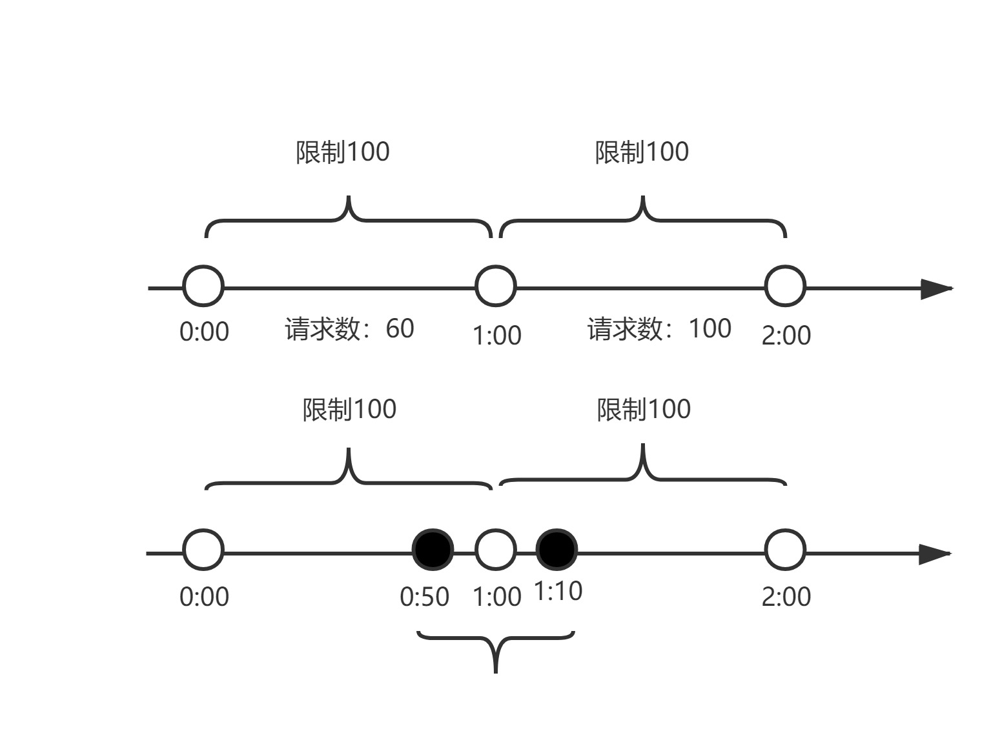
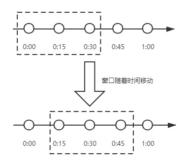
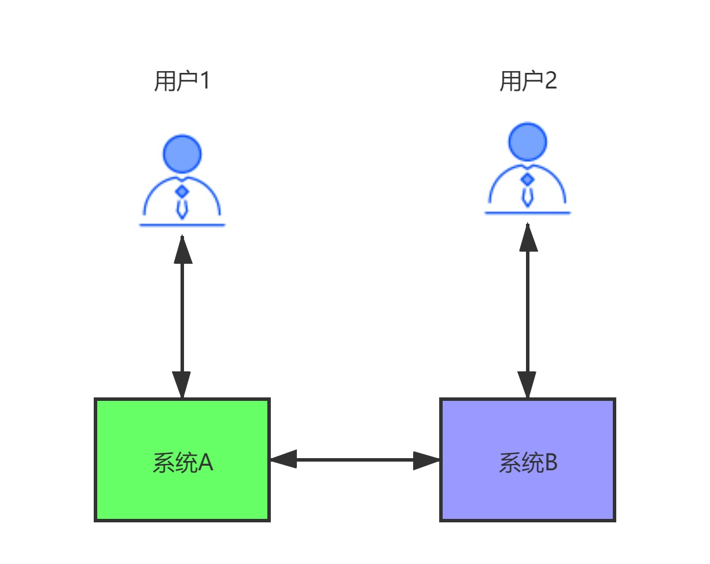

# 计数器算法是什么？

		计数器算法，是指在指定的时间周期内累加访问次数，达到设定的阈值时，触发限流策略。下一个时间周期进行访问时，访问次数清零。此算法无论在单机还是分布式环境下实现都非常简单，使用redis的incr原子自增性，再结合key的过期时间，即可轻松实现。

		从上图我们来看，我们设置一分钟的阈值是100，在0:00到1:00内请求数是60，当到1:00时，请求数清零，从0开始计算，这时在1:00到2:00之间我们能处理的最大的请求为100，超过100个的请求，系统都拒绝。
	
		这个算法有一个临界问题，比如在上图中，在0:00到1:00内，只在0:50有60个请求，而在1:00到2:00之间，只在1:10有60个请求，虽然在两个一分钟的时间内，都没有超过100个请求，但是在0:50到1:10这20秒内，确有120个请求，虽然在每个周期内，都没超过阈值，但是在这20秒内，已经远远超过了我们原来设置的1分钟内100个请求的阈值。

# 滑动时间窗口算法是什么？

		为了解决计数器算法的临界值的问题，发明了滑动窗口算法。在TCP网络通信协议中，就采用滑动时间窗口算法来解决网络拥堵问题。
	
		滑动时间窗口是将计数器算法中的实际周期切分成多个小的时间窗口，分别在每个小的时间窗口中记录访问次数，然后根据时间将窗口往前滑动并删除过期的小时间窗口。最终只需要统计滑动窗口范围内的小时间窗口的总的请求数即可。

		在上图中，假设我们设置一分钟的请求阈值是100，我们将一分钟拆分成4个小时间窗口，这样，每个小的时间窗口只能处理25个请求，我们用虚线方框表示滑动时间窗口，当前窗口的大小是2，也就是在窗口内最多能处理50个请求。随着时间的推移，滑动窗口也随着时间往前移动，比如上图开始时，窗口是0:00到0:30的这个范围，过了15秒后，窗口是0:15到0:45的这个范围，窗口中的请求重新清零，这样就很好的解决了计数器算法的临界值问题。
	
		在滑动时间窗口算法中，我们的小窗口划分的越多，滑动窗口的滚动就越平滑，限流的统计就会越精确。

# 漏桶限流算法是什么？

		漏桶算法的原理就像它的名字一样，我们维持一个漏斗，它有恒定的流出速度，不管水流流入的速度有多快，漏斗出水的速度始终保持不变，类似于消息中间件，不管消息的生产者请求量有多大，消息的处理能力取决于消费者。
	
		漏桶的容量=漏桶的流出速度*可接受的等待时长。在这个容量范围内的请求可以排队等待系统的处理，超过这个容量的请求，才会被抛弃。
	
		在漏桶限流算法中，存在下面几种情况：

1. 当请求速度大于漏桶的流出速度时，也就是请求量大于当前服务所能处理的最大极限值时，触发限流策略。

2. 请求速度小于或等于漏桶的流出速度时，也就是服务的处理能力大于或等于请求量时，正常执行。

   漏桶算法有一个缺点：当系统在短时间内有突发的大流量时，漏桶算法处理不了。

# 令牌桶限流算法是什么？

		令牌桶算法，是增加一个大小固定的容器，也就是令牌桶，系统以恒定的速率向令牌桶中放入令牌，如果有客户端来请求，先需要从令牌桶中拿一个令牌，拿到令牌，才有资格访问系统，这时令牌桶中少一个令牌。当令牌桶满的时候，再向令牌桶生成令牌时，令牌会被抛弃。
	
		在令牌桶算法中，存在以下几种情况：

1. 请求速度大于令牌的生成速度：那么令牌桶中的令牌会被取完，后续再进来的请求，由于拿不到令牌，会被限流。

2. 请求速度等于令牌的生成速度：那么此时系统处于平稳状态。

3. 请求速度小于令牌的生成速度：那么此时系统的访问量远远低于系统的并发能力，请求可以被正常处理。

   令牌桶算法，由于有一个桶的存在，可以处理短时间大流量的场景。这是令牌桶和漏桶的一个区别。

# 你设计微服务时遵循什么原则？

1. 单一职责原则：让每个服务能独立，有界限的工作，每个服务只关注自己的业务。做到高内聚。
2. 服务自治原则：每个服务要能做到独立开发、独立测试、独立构建、独立部署，独立运行。与其他服务进行解耦。
3. 轻量级通信原则：让每个服务之间的调用是轻量级，并且能够跨平台、跨语言。比如采用RESTful风格，利用消息队列进行通信等。
4. 粒度进化原则：对每个服务的粒度把控，其实没有统一的标准，这个得结合我们解决的具体业务问题。不要过度设计。服务的粒度随着业务和用户的发展而发展。

	总结一句话，软件是为业务服务的，好的系统不是设计出来的，而是进化出来的。

# CAP定理是什么？

		CAP定理，又叫布鲁尔定理。指的是：在一个分布式系统中，最多只能同时满足一致性（Consistency）、可用性（Availability）和分区容错性（Partition tolerance）这三项中的两项。

+ C：一致性（Consistency），数据在多个副本中保持一致，可以理解成两个用户访问两个系统A和B，当A系统数据有变化时，及时同步给B系统，让两个用户看到的数据是一致的。

+ A：可用性（Availability），系统对外提供服务必须一直处于可用状态，在任何故障下，客户端都能在合理时间内获得服务端非错误的响应。

+ P：分区容错性（Partition tolerance），在分布式系统中遇到任何网络分区故障，系统仍然能对外提供服务。网络分区，可以这样理解，在分布式系统中，不同的节点分布在不同的子网络中，有可能子网络中只有一个节点，在所有网络正常的情况下，由于某些原因导致这些子节点之间的网络出现故障，导致整个节点环境被切分成了不同的独立区域，这就是网络分区。

  ​	

  我们来详细分析一下CAP，为什么只能满足两个。看下图所示：

  

  

  		用户1和用户2分别访问系统A和系统B，系统A和系统B通过网络进行同步数据。理想情况是：用户1访问系统A对数据进行修改，将data1改成了data2，同时用户2访问系统B，拿到的是data2数据。
	
  		但是实际中，由于分布式系统具有八大谬论：

  + 网络相当可靠

  + 延迟为零

  + 传输带宽是无限的

  + 网络相当安全

  + 拓扑结构不会改变

  + 必须要有一名管理员

  + 传输成本为零

  + 网络同质化

  我们知道，只要有网络调用，网络总是不可靠的。我们来一一分析。

  1. 当网络发生故障时，系统A和系统B没法进行数据同步，也就是我们不满足P，同时两个系统依然可以访问，那么此时其实相当于是单机系统，就不是分布式系统了，所以既然我们是分布式系统，P必须满足。
  2. 当P满足时，如果用户1通过系统A对数据进行了修改将data1改成了data2，也要让用户2通过系统B正确的拿到data2，那么此时是满足C，就必须等待网络将系统A和系统B的数据同步好，并且在同步期间，任何人不能访问系统B（让系统不可用），否则数据就不是一致的。此时满足的是CP。
  3. 当P满足时，如果用户1通过系统A对数据进行了修改将data1改成了data2，也要让系统B能继续提供服务，那么此时，只能接受系统A没有将data2同步给系统B（牺牲了一致性）。此时满足的就是AP。

        我们在前面学过的注册中心Eureka就是满足 的AP，它并不保证C。而Zookeeper是保证CP，它不保证A。在生产中，A和C的选择，没有正确的答案，是取决于自己的业务的。比如12306，是满足CP，因为买票必须满足数据的一致性，不然一个座位多卖了，对铁路运输都是不可以接受的。

# BASE理论是什么？

由于CAP中一致性C和可用性A无法兼得，eBay的架构师，提出了BASE理论，它是通过牺牲数据的强一致性，来获得可用性。它由于如下3种特征：

+ **B**asically **A**vailable（基本可用）：分布式系统在出现不可预知故障的时候，允许损失部分可用性，保证核心功能的可用。

+ **S**oft state（软状态）：软状态也称为弱状态，和硬状态相对，是指允许系统中的数据存在中间状态，并认为该中间状态的存在不会影响系统的整体可用性，即允许系统在不同节点的数据副本之间进行数据同步的过程存在延时。、

+ **E**ventually consistent（最终一致性）：最终一致性强调的是系统中所有的数据副本，在经过一段时间的同步后，最终能够达到一个一致的状态。因此，最终一致性的本质是需要系统保证最终数据能够达到一致，而不需要实时保证系统数据的强一致性。

        BASE理论并没有要求数据的强一致性，而是允许数据在一定的时间段内是不一致的，但在最终某个状态会达到一致。在生产环境中，很多公司，会采用BASE理论来实现数据的一致，因为产品的可用性相比强一致性来说，更加重要。比如在电商平台中，当用户对一个订单发起支付时，往往会调用第三方支付平台，比如支付宝支付或者微信支付，调用第三方成功后，第三方并不能及时通知我方系统，在第三方没有通知我方系统的这段时间内，我们给用户的订单状态显示支付中，等到第三方回调之后，我们再将状态改成已支付。虽然订单状态在短期内存在不一致，但是用户却获得了更好的产品体验。

# 2PC提交协议是什么？

二阶段提交(Two-phaseCommit)是指，在计算机网络以及数据库领域内，为了使基于分布式系统架构下的所有节点在进行事务提交时保持一致性而设计的一种算法(Algorithm)。通常，二阶段提交也被称为是一种协议(Protocol))。在分布式系统中，每个节点虽然可以知晓自己的操作时成功或者失败，却无法知道其他节点的操作的成功或失败。当一个事务跨越多个节点时，为了保持事务的ACID特性，需要引入一个作为协调者的组件来统一掌控所有节点(称作参与者)的操作结果并最终指示这些节点是否要把操作结果进行真正的提交(比如将更新后的数据写入磁盘等等)。因此，**二阶段提交的算法思路可以概括为：参与者将操作成败通知协调者，再由协调者根据所有参与者的反馈情报决定各参与者是否要提交操作还是中止操作。**

所谓的两个阶段是指：第一阶段：**准备阶段(投票阶段)**和第二阶段：**提交阶段（执行阶段）**。

准备阶段

事务协调者(事务管理器)给每个参与者(资源管理器)发送Prepare消息，每个参与者要么直接返回失败(如权限验证失败)，要么在本地执行事务，写本地的redo和undo日志，但不提交，到达一种“万事俱备，只欠东风”的状态。

可以进一步将准备阶段分为以下三个步骤：

> 1）协调者节点向所有参与者节点询问是否可以执行提交操作(vote)，并开始等待各参与者节点的响应。
>
> 2）参与者节点执行询问发起为止的所有事务操作，并将Undo信息和Redo信息写入日志。（注意：若成功这里其实每个参与者已经执行了事务操作）
>
> 3）各参与者节点响应协调者节点发起的询问。如果参与者节点的事务操作实际执行成功，则它返回一个”同意”消息；如果参与者节点的事务操作实际执行失败，则它返回一个”中止”消息。

提交阶段

> 如果协调者收到了参与者的失败消息或者超时，直接给每个参与者发送回滚(Rollback)消息；否则，发送提交(Commit)消息；参与者根据协调者的指令执行提交或者回滚操作，释放所有事务处理过程中使用的锁资源。(注意:必须在最后阶段释放锁资源)
>
> 接下来分两种情况分别讨论提交阶段的过程。
>
> 当协调者节点从所有参与者节点获得的相应消息都为”同意”时:
>
> 
>
> > 1）协调者节点向所有参与者节点发出”正式提交(commit)”的请求。
> >
> > 2）参与者节点正式完成操作，并释放在整个事务期间内占用的资源。
> >
> > 3）参与者节点向协调者节点发送”完成”消息。
> >
> > 4）协调者节点受到所有参与者节点反馈的”完成”消息后，完成事务。

如果任一参与者节点在第一阶段返回的响应消息为”中止”，或者 协调者节点在第一阶段的询问超时之前无法获取所有参与者节点的响应消息时：

> 1）协调者节点向所有参与者节点发出”回滚操作(rollback)”的请求。
>
> 2）参与者节点利用之前写入的Undo信息执行回滚，并释放在整个事务期间内占用的资源。
>
> 3）参与者节点向协调者节点发送”回滚完成”消息。
>
> 4）协调者节点受到所有参与者节点反馈的”回滚完成”消息后，取消事务。

　　不管最后结果如何，第二阶段都会结束当前事务。

# 2PC提交协议有什么缺点？

1. **同步阻塞问题**。执行过程中，所有参与节点都是事务阻塞型的。当参与者占有公共资源时，其他第三方节点访问公共资源不得不处于阻塞状态。

2. **单点故障**。由于协调者的重要性，一旦协调者发生故障。参与者会一直阻塞下去。尤其在第二阶段，协调者发生故障，那么所有的参与者还都处于锁定事务资源的状态中，而无法继续完成事务操作。（如果是协调者挂掉，可以重新选举一个协调者，但是无法解决因为协调者宕机导致的参与者处于阻塞状态的问题）

3. **数据不一致**。在二阶段提交的阶段二中，当协调者向参与者发送commit请求之后，发生了局部网络异常或者在发送commit请求过程中协调者发生了故障，这回导致只有一部分参与者接受到了commit请求。而在这部分参与者接到commit请求之后就会执行commit操作。但是其他部分未接到commit请求的机器则无法执行事务提交。于是整个分布式系统便出现了数据部一致性的现象。

4. 二阶段无法解决的问题：协调者再发出commit消息之后宕机，而唯一接收到这条消息的参与者同时也宕机了。那么即使协调者通过选举协议产生了新的协调者，这条事务的状态也是不确定的，没人知道事务是否被已经提交。

# 3PC提交协议是什么？

CanCommit阶段

3PC的CanCommit阶段其实和2PC的准备阶段很像。协调者向参与者发送commit请求，参与者如果可以提交就返回Yes响应，否则返回No响应。

> **1.事务询问** 协调者向参与者发送CanCommit请求。询问是否可以执行事务提交操作。然后开始等待参与者的响应。
>
> **2.响应反馈** 参与者接到CanCommit请求之后，正常情况下，如果其自身认为可以顺利执行事务，则返回Yes响应，并进入预备状态。否则反馈No

PreCommit阶段

协调者根据参与者的反应情况来决定是否可以进行事务的PreCommit操作。根据响应情况，有以下两种可能。

**假如协调者从所有的参与者获得的反馈都是Yes响应，那么就会执行事务的预执行。**

> **1.发送预提交请求** 协调者向参与者发送PreCommit请求，并进入Prepared阶段。
>
> **2.事务预提交** 参与者接收到PreCommit请求后，会执行事务操作，并将undo和redo信息记录到事务日志中。
>
> **3.响应反馈** 如果参与者成功的执行了事务操作，则返回ACK响应，同时开始等待最终指令。

**假如有任何一个参与者向协调者发送了No响应，或者等待超时之后，协调者都没有接到参与者的响应，那么就执行事务的中断。**

> **1.发送中断请求** 协调者向所有参与者发送abort请求。
>
> **2.中断事务** 参与者收到来自协调者的abort请求之后（或超时之后，仍未收到协调者的请求），执行事务的中断。

pre阶段参与者没收到请求，rollback。

doCommit阶段

该阶段进行真正的事务提交，也可以分为以下两种情况。

**执行提交**

> **1.发送提交请求** 协调接收到参与者发送的ACK响应，那么他将从预提交状态进入到提交状态。并向所有参与者发送doCommit请求。
>
> **2.事务提交** 参与者接收到doCommit请求之后，执行正式的事务提交。并在完成事务提交之后释放所有事务资源。
>
> **3.响应反馈** 事务提交完之后，向协调者发送Ack响应。
>
> **4.完成事务** 协调者接收到所有参与者的ack响应之后，完成事务。

**中断事务** 协调者没有接收到参与者发送的ACK响应（可能是接受者发送的不是ACK响应，也可能响应超时），那么就会执行中断事务。

> **1.发送中断请求** 协调者向所有参与者发送abort请求
>
> **2.事务回滚** 参与者接收到abort请求之后，利用其在阶段二记录的undo信息来执行事务的回滚操作，并在完成回滚之后释放所有的事务资源。
>
> **3.反馈结果** 参与者完成事务回滚之后，向协调者发送ACK消息
>
> **4.中断事务** 协调者接收到参与者反馈的ACK消息之后，执行事务的中断。

# 2PC和3PC的区别是什么？

1、引入超时机制。同时在协调者和参与者中都引入超时机制。

2、三阶段在2PC的第一阶段和第二阶段中插入一个准备阶段。保证了在最后提交阶段之前各参与节点的状态是一致的。