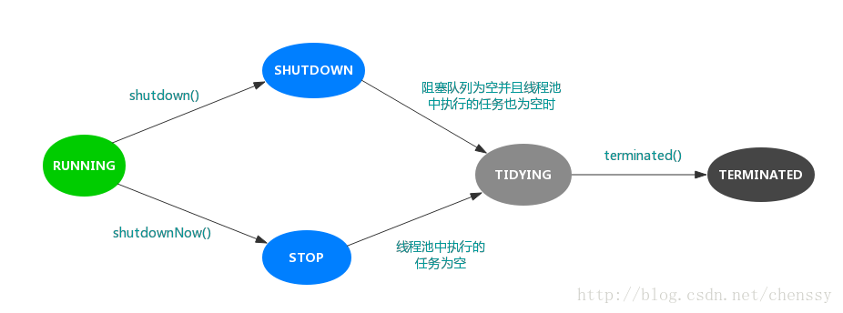

线程池五种状态：

**RUNNING（状态值-1，高3位值是111）:** 接收新任务并处理队列中的任务

**SHUTDOWN（状态值0，高3位值是000）:** 不接收新任务但会处理队列中的任务。

**STOP（状态值1，高3位值是001）:** 不接收新任务，不处理队列中的任务，并中断正在处理的任务

**TIDYING（状态值2，高3位值是010）:** 所有任务已终止，workerCount为0，处于TIDYING状态的线程将调用钩子方法terminated()。

**TERMINATED（状态值3，高3位值是011）:** terminated()方法完成

```java
/*
变量ctl，记录了“线程池中的任务数量”和“线程池的状态”两个信息。
32 bit位，高3位表示"线程池状态"，低29位表示"线程池中的任务数量"。
*/
private final AtomicInteger ctl = new AtomicInteger(ctlOf(RUNNING, 0));
```


线程池状态转化：

